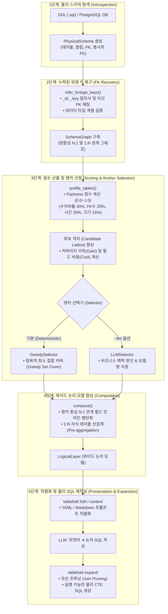

# tablefold

> 방대한 물리 데이터베이스 스키마를 LLM이 한눈에 이해할 수 있는 소수의 **와이드 논리 모델(Wide Logical Models)**로 접고(Fold), 작성된 쿼리를 실제 실행 가능한 물리 SQL로 다시 펼쳐주는(Expand) 도구입니다.

```
53개 물리 테이블  ──fold(접기)──>  7개 논리 모델 (~3k 토큰)
                   <─expand(펼치기)──  실제 실행되는 SQL
```

---

## 💡 왜 tablefold인가요?

실제 DB 대상 Text-to-SQL이 실패하는 주요 원인은 LLM의 추론 능력 부족이 아닌 **과도한 DDL 문맥(Context)과 복잡한 조인 관계** 때문입니다.

`tablefold`는 연관된 테이블을 하나의 와이드 모델(`orders`, `products` 등)로 합쳐주어 LLM이 조인 추론 없이 한 번에 쿼리를 작성할 수 있게 돕고, 생성된 쿼리는 데이터 왜곡 없이 안전한 물리 SQL로 자동 변환합니다.

---

## ⚡ 빠른 시작 (Quick Start)

### 1. 설치

```bash
uv sync                          # 기본 설치
uv sync --extra postgres         # PostgreSQL 연동 지원
```

### 2. 사용법

```bash
# 1. 물리 스키마를 논리 모델로 접기
tablefold fold --ddl fixtures/retail_50.sql

# 2. LLM 전달용 프롬프트 메타데이터 출력
tablefold context --ddl fixtures/retail_50.sql --field-budget 120

# 3. 논리 SQL을 실행 가능한 물리 SQL로 변환 (필요한 조인만 자동 추림)
tablefold expand "SELECT customer_tier_label, SUM(grand_total) FROM orders GROUP BY 1" \
    --ddl fixtures/retail_50.sql
```

#### Python API 사용 예시

```python
from tablefold.introspect.ddl import DDLIntrospector
from tablefold.pipeline import fold
from tablefold.expand import expand

# 스키마 분석 및 논리 모델 구성
schema = DDLIntrospector.from_path("schema.sql").introspect()
result = fold(schema)

# 쿼리 변환
expansion = expand("SELECT SUM(grand_total) FROM orders", result.layer, result.graph)
print(expansion.sql)
```

---

## 🔄 파이프라인 다이어그램 및 단계별 로직 (Pipeline Architecture)

`tablefold`는 물리 스키마를 수집하는 단계부터 최종 물리 SQL로 변환하기까지 5단계의 명확한 단방향 데이터 흐름을 따릅니다.



### 📋 단계별 실행 순서 및 모듈

| 단계 | 순서 및 과정 | 담당 모듈 | 핵심 역할 |
|:---:|---|---|---|
| **1단계** | **물리 스키마 탐색** <br/>*(Introspection)* | `tablefold.introspect` | DDL SQL 파일이나 PostgreSQL 실 DB 메타데이터로부터 테이블, 컬럼, PK, 명시적 FK 정보 추출 후 `PhysicalSchema` 객체 생성 |
| **2단계** | **외래 키 추론 및 복구** <br/>*(FK Recovery)* | `tablefold.graph` | `_id`, `_key` 등의 컬럼명과 타깃 PK, 데이터 타입을 비교하여 누락된 FK를 복구하고 방향성 그래프(`SchemaGraph`) 구축 |
| **3단계** | **점수 산출 및 앵커 선정** <br/>*(Scoring & Selection)* | `tablefold.scoring`<br/>`tablefold.clustering` | • **Scoring**: 수치 컬럼 비율/FK 수/시간 데이터로 Factness 점수(0.0~1.0) 계산<br/>• **Selection**: 최소 모델로 최대 커버리지를 얻도록 `GreedySelector`로 앵커 선정 (옵션 시 `LLMSelector` 사용) |
| **4단계** | **와이드 논리 모델 합성** <br/>*(Composition)* | `tablefold.composition` | 선정된 앵커를 중심으로 N:1 조인 경로를 인라인 평탄화하고, 1:N 자식 테이블은 입도(Grain) 보존을 위해 미리 `GROUP BY` 선집계(Pre-aggregation) 필드로 합성 |
| **5단계** | **직렬화 및 물리 SQL 재작성** <br/>*(Presentation & Expansion)* | `tablefold.presentation`<br/>`tablefold.expansion` | • **Fold/Context**: 논리 모델 구조를 YAML/Markdown 형태의 프롬프트 직렬화<br/>• **Expand**: LLM이 작성한 논리 SQL을 받아 불필요한 조인을 제거(Join Pruning) 후 실제 물리 CTE SQL로 자동 재작성 |

---

## ⚙️ 핵심 작동 로직 (Core Logic)

`tablefold`는 파이프라인 전 과정이 비결정론적 환각 없이 **결정론적(Deterministic)**으로 작동하도록 설계되었습니다.

### 1. 누락된 외래 키 복구 (FK Recovery)
데이터베이스 덤프나 DDL에 외래 키(FK) 제약 조건이 누락된 경우가 많습니다. `tablefold`는 컬럼명과 타깃 테이블 키 패턴(`customer_id` → `customers.id`)을 추론하여 누락된 FK 관계를 자동으로 복구하고 그래프를 재구성합니다.

### 2. 앵커(Anchor) 선정 & 최소 집합 커버 (Greedy Set Cover)
팩트 점수가 높은 테이블만 앵커로 지정하면 인접한 팩트 테이블만 중복 선택됩니다. `tablefold`는 탐욕적 최소 집합 커버(Set Cover) 알고리즘으로 **최소한의 모델 수로 스키마 커버리지를 극대화**합니다.
- **비용 통제 (`--max-cost`)**: 새로운 테이블 1개를 커버하기 위해 너무 많은 필드를 소비(토큰 낭비)하는 모델은 자동 배제합니다.
- **LLM 앵커 보완 (`--llm`)**: 수치적 계산(커버리지/비용)은 그래프 알고리즘이 담당하되, 도메인 맥락 파악 및 모델 네이밍은 LLM이 보완할 수 있습니다.

### 3. 데이터 그레인(Grain) 보존 (Pre-aggregation)
1:N 관계인 자식 테이블을 단순 `JOIN`하면 행 수가 늘어나면서 매출이나 수량이 중복 계산(Fan-out)되는 심각한 오류가 발생합니다.
`tablefold`는 자식 테이블을 조인하기 전에 **미리 `GROUP BY`로 선집계**하여 부모 행의 입도(Grain)를 완벽히 유지합니다.

```sql
-- 자식 테이블(order_items)을 먼저 선집계한 뒤 조인하여 주문 행 수가 왜곡되지 않음
LEFT JOIN (
  SELECT order_id, SUM(line_total) AS order_items_line_total_sum
  FROM order_items
  GROUP BY order_id
) AS agg_order_items ON base.id = agg_order_items.order_id
```

### 4. 조인 프루닝 (Join Pruning)
논리 모델이 15개 테이블을 포함하더라도, LLM이 작성한 SQL에서 실제로 사용한 필드에 필요한 조인 경로만 추려서 물리 CTE SQL로 변환합니다.

```sql
-- 쿼리에서 customer_tier_label과 grand_total만 참조한 경우 (불필요한 조인 제거)
WITH tf__orders AS (
  SELECT
    base.grand_total AS grand_total,
    j_customers__customer_tiers.label AS customer_tier_label
  FROM orders AS base
  LEFT JOIN customers AS j_customers ON base.customer_id = j_customers.id
  LEFT JOIN customer_tiers AS j_customers__customer_tiers ON j_customers.tier_id = j_customers__customer_tiers.id
)
SELECT customer_tier_label, SUM(grand_total) AS revenue
FROM tf__orders GROUP BY customer_tier_label
```

---

## 프로젝트 디렉토리 구조 (Directory Structure)

`tablefold`는 관심사의 분리와 단방향 데이터 흐름 구조로 모듈화되어 있습니다.

- `src/tablefold/schema/`: 물리 스키마(PhysicalSchema) 및 논리 모델(LogicalModel) 등의 중간 표현(IR) 불변 객체 정의 (`ir.py`)
- `src/tablefold/introspect/`: DDL 파일 파싱 및 실시간 PostgreSQL 스키마 추출 (`base.py`, `ddl.py`, `postgres.py`)
- `src/tablefold/graph/`: 방향성 외래키 그래프 구축 및 암묵적 외래키 자동 추론 (`graph.py`)
- `src/tablefold/scoring/`: 테이블의 Fact / Dimension 특성 분석 및 점수 산출 (`classify.py`)
- `src/tablefold/clustering/`: 후보 격자 생성 및 앵커 선택기 (Greedy Set Cover 및 LLM 선택기) (`cluster.py`, `select.py`)
- `src/tablefold/composition/`: 앵커 기준의 입도 보존 와이드 논리 모델 합성 (`compose.py`)
- `src/tablefold/presentation/`: 비용 산정, 직렬화/렌더링 및 LLM 완결 어댑터 (`cost.py`, `emit.py`, `llm.py`)
- `src/tablefold/expansion/`: 논리 SQL을 입도 보존 및 Join Pruning이 적용된 물리 SQL로 변환 (`expand.py`)
- `src/tablefold/pipeline/`: 전체 파이프라인 단일 호출 진입점 (`pipeline.py`)
- `src/tablefold/cli/`: 커맨드 라인 인터페이스 명령 (`main.py`)

---

## 🛠️ 주요 접기 옵션 (Fold Options)

| 옵션 | 기본값 | 설명 |
|---|---|---|
| `--coverage` | `0.90` | 전체 테이블 커버리지 목표 비율 (예: 0.9 = 90%) |
| `--min-gain` | `2` | 모델 1개 추가 시 가져와야 할 최소 신규 테이블 수 |
| `--max-cost` | `10` | 신규 테이블 1개당 허용 필드 비용 한도 |
| `--llm` | - | LLM 기반 의미론적 앵커 선정 및 모델명 지정 기능 사용 |

---

## 🧪 개발 및 테스트

```bash
uv run pytest tests/           # 테스트 실행
uv run ruff check src tests    # 린트 체크
```