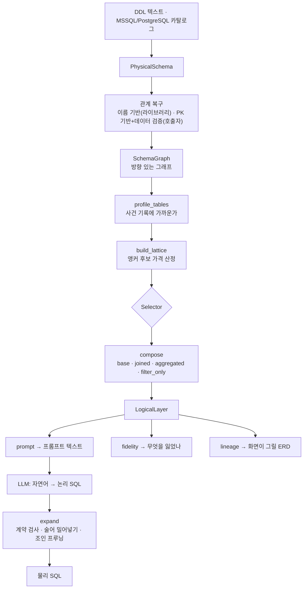

# tablefold — 컨셉, 로직, 실측, 장단점

물리 데이터베이스 스키마를 **소수의 넓은 논리 모델**로 접고(Fold), 그 모델을 향해
쓰인 논리 SQL을 실행 가능한 물리 SQL로 되돌린다(Expand).

> Wren AI의 시맨틱 레이어 컨셉을 참조했지만 구현을 가져오지 않았다. 아래 1장은
> 공개된 개념 수준의 정리이며, 이 프로젝트에서 Wren AI의 소스를 읽고 대조한 것은
> 아니다. 2장부터가 이 저장소의 실제 코드다.

---

## 1. Wren AI의 컨셉

### 문제 인식

전통적인 Text-to-SQL은 물리 스키마(테이블 수백 개, 컬럼 수천 개, 조인 제약)를
LLM에 그대로 던진다. 세 가지가 무너진다.

- **컨텍스트 비용** — 쿼리당 수만 토큰. 프롬프트에 다 안 들어가고, 들어가도
  신호 대 잡음이 나쁘다
- **추론 지연** — 컨텍스트가 크면 응답이 느려지고 타임아웃이 난다
- **조인 환각** — 어느 키로 어느 방향으로 이어야 하는지를 LLM이 매번 다시
  추론하고, 매번 다르게 추론한다

Wren AI는 이 문제를 **두 개의 축**으로 나눠서 푼다. 이 둘은 서로 다른 시점에
작동하고, 섞어서 이해하면 뒤에 나올 비교가 흐려진다.

### 축 1 — MDL: 사람이 쓰는 시맨틱 계약

물리 스키마 위에 **비즈니스 의미를 담은 층**을 하나 둔다. LLM은 물리 테이블이
아니라 그 층을 향해 질의하고, 시스템이 물리 SQL로 되돌린다.

그 층을 기술하는 것이 **MDL**(Modeling Definition Language) — 원시 DDL의 소음을
걷어내고 관계·계산 필드·지표를 명시한 선언적 YAML/JSON 세맨틱 계약이다.

| MDL 구성 | 역할 |
|---|---|
| **Model** | 비즈니스 개념 하나 (`Order`, `Customer`). 물리 테이블에 대응하지만 이름과 컬럼을 사람이 다시 정한다 |
| **Relationship** | 모델 간 관계와 **카디널리티**(N:1, 1:N)를 명시. 승인된 조인 경로가 된다 |
| **Calculated field** | 관계를 따라가 계산되는 파생 컬럼 |
| **Metric / Aggregation** | `총매출` 같은 업무 지표의 산출 공식을 미리 고정 |

실행 엔진은 **wren-core** — Rust + Apache DataFusion 기반이다. MDL 매니페스트를
파싱해 CTE 확장과 자동 JOIN 주입을 수행하고, 타깃 데이터베이스의 네이티브 SQL로
컴파일한다. LLM의 확률적 추론이 결정론적 SQL 생성으로 바뀌는 자리가 여기다.

### 축 2 — 질의 시점 스키마 압축 파이프라인

MDL이 아무리 정갈해도 모델이 수백 개면 여전히 프롬프트에 안 들어간다. 그래서
**질문이 들어올 때마다** 스키마를 잘라낸다. 3단계다.

1. **다중 벡터 색인** — 스키마를 `TABLE_SCHEMA`, `TABLE_COLUMNS`, `METRIC/VIEW`,
   `QA_PAIR` 단위로 쪼개 벡터 DB(Qdrant)에 색인한다
2. **시맨틱 검색 + 테이블 재선택** — 질문으로 후보 테이블 Top-K(≈10)를 뽑고,
   LLM 2차 검증으로 진짜 필요한 2~3개만 남긴다 (False Positive 제거)
3. **스칼라 컬럼 가지치기** — 그 질문의 집계·필터·조인에 직결되는 컬럼과 수식만
   추출해 고밀도 컨텍스트를 재구성한다

효과는 쿼리당 10,000~50,000+ 토큰이 수백~1,000 토큰대로 줄어드는 것 —
**80~90% 절감**이다. 다만 이 수치는 *질문 하나가 보는 컨텍스트*의 크기이지,
스키마 전체를 담은 프롬프트의 크기가 아니다. 2장의 비교에서 이 구분이 핵심이 된다.

### 핵심은 "사람이 쓴다"는 것

MDL은 **사람이 작성한다.** 그게 강점이자 약점이다.

- **강점** — 업무 지식이 들어간다. `총매출`이 무엇을 뜻하는지, 어느 조직 체계가
  기준인지는 스키마에 안 적혀 있고 사람만 안다. 그리고 그것이 지표 공식으로
  고정되므로 LLM이 임의로 변형할 수 없다 — 거버넌스가 성립한다.
- **약점** — 스키마가 크면 작성 비용이 크고, 스키마가 바뀌면 다시 써야 하고,
  처음 붙이는 데이터베이스에는 아무것도 없는 상태에서 시작한다.

---

## 2. 무엇을 참조하고 무엇을 다르게 했나

### 가져온 컨셉 셋

**하나. 논리 계층을 따로 둔다.**
LLM이 물리 테이블을 직접 보지 않는다. 넓은 논리 모델을 보고, 그 모델의 이름과
필드 이름만으로 SQL을 쓴다. 이게 이 프로젝트의 출발점이다.

**둘. 카디널리티를 일급으로 다룬다.**
Wren AI가 관계에 N:1 / 1:N을 명시하듯, 이쪽도 `Cardinality`를 IR의 핵심 타입으로
둔다. 다만 용도가 다르다 — Wren은 조인 *경로를 찾는* 데 쓰고, 이쪽은 **인라인해도
되는지 아니면 먼저 접어야 하는지**를 가르는 데 쓴다(3장).

**셋. 논리 SQL을 물리 SQL로 되돌린다.**
`rewrite/expand.py`가 wren-core의 위치에 해당한다. CTE 확장과 조인 주입이라는
발상 자체가 같다.

### 다른 것 하나 — 압축의 시점

가장 자주 오해되는 차이가 여기다. 둘 다 "스키마를 압축한다"고 말하지만 **압축이
일어나는 시점이 다르고, 그래서 압축의 단위가 다르다.**

| | Wren AI | tablefold |
|---|---|---|
| 압축 시점 | **질의 시점** (질문마다) | **빌드 시점** (스키마마다 한 번) |
| 압축 단위 | 이 질문에 필요한 테이블/컬럼 | 스키마 전체를 담은 논리 레이어 |
| 필요 인프라 | 벡터 DB, 임베딩, LLM 재선택 호출 | 없음 — 그래프 알고리즘 |
| 질문 시점 비용 | 검색 + 재선택 LLM 호출 1회 | 0 (레이어는 이미 만들어져 있다) |
| 못 고른 테이블 | 검색이 놓치면 **답이 없다** | 레이어에 없으면 답이 없다 (동일) |
| 프롬프트에 들어가는 것 | 이 질문용 2~3 테이블 | 레이어 전체 (실측 약 18~19k자) |

Wren AI의 파이프라인은 **RAG**다. 질문이 색인을 때리고, 맞는 조각을 꺼낸다.
tablefold는 색인을 만들지 않는다. 대신 스키마를 **한 번** 접어서 그 결과를 통째로
프롬프트에 넣는다. 그래서:

- Wren AI 쪽은 스키마가 수백 테이블이어도 확장된다. tablefold는 레이어 전체가
  프롬프트에 들어가야 하므로 **스키마 크기에 상한이 있다.** 이게 가장 큰 구조적 제약이다.
- 반대로 tablefold는 검색이 틀릴 자리가 없다. 질문이 무엇이든 같은 레이어를 본다.
  "검색이 놓쳐서 답을 못 한다"는 실패 양식이 존재하지 않는다.
- Wren AI의 "80~90% 절감"과 tablefold의 프롬프트 크기는 **같은 축의 수치가 아니다.**
  전자는 질문당 컨텍스트, 후자는 스키마 전체다. 나란히 놓고 비교하면 안 된다.

질의 시점에 tablefold가 하는 유일한 가지치기는 **조인 프루닝**이다(4-7). 스키마를
좁히는 것이 아니라, 이미 확정된 모델 안에서 질의가 실제로 쓴 필드에 필요한 조인만
만든다. 축이 다르다.

### 다른 것 둘 — MDL을 사람이 안 쓴다

**논리 계층을 스키마와 데이터에서 자동으로 유도한다.**

| | Wren AI | tablefold |
|---|---|---|
| 논리 계층 출처 | 사람이 MDL 작성 | 그래프 알고리즘이 유도 |
| 관계 | 사람이 선언 | 키 추론 + 실제 데이터로 위반율 검증 |
| 모델 경계 | 사람이 결정 | 앵커 선택 (집합 커버) |
| 지표 공식 | MDL에 선언 (`총매출 = …`) | **없음** ← 명백한 약점 |
| 필드 이름 | 사람이 명명 | 물리 컬럼 이름 그대로 |
| 품질 판단 | 작성자의 판단 | **측정** (6장) |

그래서 이건 Wren AI의 대체재가 아니다. **처음 붙이는 데이터베이스에서 사람이
아무것도 안 썼을 때 자동으로 나오는 출발점**이고, 업무 지식은 그 위에 얹어야 한다.

### 자동으로 하면 새로 생기는 문제

사람이 쓰면 사람이 책임진다. 자동으로 만들면 **아무도 검증하지 않은 것을 LLM에
주게 된다.** 그래서 이 프로젝트에는 Wren AI에 없는 두 가지가 추가로 필요했다.

- **측정** — 접은 결과가 원본을 얼마나 대변하는지 재는 축 (6장)
- **집행** — 논리 계층이 계약이라면 코드가 그 계약을 지키게 해야 한다 (4-7)

---

## 3. 왜 이런 구조가 나오는가

### 문제는 입도(grain)다

조인은 틀려도 예외를 던지지 않는다. 문법이 맞으면 실행되고 숫자만 틀린다.

**입도**란 "한 줄이 무엇을 뜻하는가"다. 조인은 이 뜻을 바꾸는데, **방향에 따라
다르게 바꾼다.**

- **정방향**(외래 키를 따라감) — 참조 대상이 최대 한 행이라 줄 수가 안 변한다.
  주문에 고객 이름을 붙여도 여전히 주문 하나가 한 줄이다.
- **역방향**(참조당하는 쪽에서 봄) — 하나에 여럿이 달린다. 고객에 주문을 붙이면
  고객이 주문 수만큼 복제된다.

그 상태에서 합계를 내면 곱해진 만큼 부풀어 오른다. 실측에서 조직·매출·계획 세 표를
그냥 이었더니 **매출 합계가 49배**가 됐다. 에러는 없었다.

### 그래서 방향별로 처리가 갈린다

| 관계 | 처리 | 근거 |
|---|---|---|
| **N:1** | 그대로 인라인 | 최대 한 행이라 입도가 보존된다 |
| **1:N** | `GROUP BY` 선집계 후 조인 | 미리 접으면 부모 키당 한 행이 되어 입도가 보존된다 |

선집계된 서브쿼리는 부모 키당 **최대 한 행**을 낸다. 뒤이은 조인이 부모의 줄 수를
바꾸지 못한다. 이것이 입도 보호(grain guard)이고 엔진의 중심 규칙이다.

Wren AI는 이 문제를 MDL의 관계 선언과 계산 필드로 다룬다. 사람이 카디널리티를
맞게 적으면 엔진이 맞게 조인한다. tablefold는 사람이 안 적으므로 **코드에 1:N을
인라인하는 경로 자체를 두지 않는** 쪽을 택했다.

### 그래서 표 하나로 못 합친다

**하나의 표는 하나의 입도만 가진다.** 구현 한계가 아니라 정의다.

"7월 3일 A품목 매출 상세"는 매출이 한 줄이어야 답할 수 있고, "조직별 매출 대 계획"은
조직이 한 줄이어야 답할 수 있다. 같은 데이터인데 질문이 요구하는 줄 단위가 다르다.

결과물은 표 하나가 아니라 **모델 여러 개**다. 개수는 "몇 개의 입도에서 물을
것인가"가 정한다.

---

## 4. 로직의 흐름과 각 기능의 역할



디렉터리는 이 파이프라인 순서를 그대로 따른다:
`read/` → `relate/` → `choose/` → `build/` → `rewrite/` → `report/`.

### 4-1. 탐색 (`read/`)

DDL 텍스트나 데이터베이스 카탈로그를 읽어 `PhysicalSchema`를 만든다. 테이블,
컬럼, 타입, 기본 키, 선언된 외래 키, 행 수 추정치.

### 4-2. 관계 복구 (`relate/`)

**왜 별도 단계인가.** 웨어하우스는 외래 키를 잘 선언하지 않는다. 적재 성능을 깎고
ETL이 이미 정합성을 보장한다고 보기 때문이다. 스타 스키마인데 `sys.foreign_keys`가
비어 있는 경우가 흔하다. 관계가 없으면 그래프가 없고, 그래프가 없으면 접을 수 없다.

두 가지 복구 수단이 있고, **호출 위치가 다르다.**

- **이름 기반** (`relate.graph.infer_foreign_keys`) — `customer_id` → `customers`.
  `fold()`가 `infer_missing_keys=True`로 **자동 호출한다.** 영어 명명 관례에
  기대므로 `ORG_CD` 같은 웨어하우스 이름에서는 실패한다.
- **기본 키 기반** (`relate.keys.infer_from_primary_keys`) — 차원의 기본 키와 같은
  이름의 컬럼을 참조로 본다. 기본 키는 선언된 사실이라 명명 관례보다 신뢰도가
  높다. **`fold()`는 이것을 호출하지 않는다** — 이 함수는 스키마만 보고 데이터를
  읽지 않으므로, 후보를 데이터로 검증하는 책임이 호출자에게 있기 때문이다.

**데이터 검증은 호출자 몫이다.** 현재 그 조립을 하는 곳은 `demo/live.py` 하나다:
후보마다 참조 대상에 없는 값의 비율(위반율)을 세고, `VIOLATION_TOLERANCE`(1%)를
넘으면 버린 뒤 남은 것의 `confidence`를 실측 위반율로 덮어쓴다. 추측이 아니라
관측으로 그래프를 만드는 자리가 여기고, **5장의 실측 결과는 전부 이 경로로 나온
것이다.** 라이브러리 `fold()`만 호출하면 이 단계는 일어나지 않는다.

### 4-3. 점수 (`choose/classify.py`)

각 테이블이 얼마나 **사건 기록**에 가까운지 0~1로 매긴다. 측정값 밀도, 시간 컬럼,
나가는 외래 키 수, 행 수. 높으면 팩트(매출·주문), 낮으면 차원(조직·품목).

관측하지 못한 신호는 **상수로 메우지 않고 항을 빼고 정규화한다**. 중립값을 넣으면
스키마 안의 다른 테이블이 통계를 갖고 있느냐에 따라 같은 테이블의 역할이 뒤집힌다.

### 4-4. 앵커 선택 (`choose/`)

앵커는 모델이 앉을 입도다. 어느 테이블을 앵커로 삼느냐가 **답할 수 있는 질문의
범위**를 정한다.

**핵심 사실 하나가 구조를 규정한다: 팩트는 팩트를 참조하지 않는다.**

팩트를 앵커로 잡으면 정방향으로 차원만 만나고 팩트에는 자식이 없다. 그래서
**팩트 간 질문이 원리적으로 불가능하다** — "매출 대 계획"을 못 묻는다.

차원을 앵커로 잡으면 뒤집힌다. 조직 하나가 한 줄이고 매출과 계획이 각각 선집계되어
나란히 붙는다. 팩트 간 질문이 조인 없이 풀린다.

**대칭이 성립한다:**
- 차원 앵커는 팩트끼리 잇는다
- 팩트 앵커는 차원끼리 잇는다 (`F_PRODUCTION`이 `D_WORKSHOP`과 `D_ITEM`을 함께)

둘 다 필요하다. 다만 **모든** 앵커가 필요하지는 않다 — **앵커가 사는 것은 테이블이
아니라 조합**이기 때문이다. 이미 다른 앵커가 담은 조합을 또 담아 봐야 새로 답할 수
있게 되는 질문이 없다. `_drop_redundant`가 그런 앵커를 뺀다.

선택기는 셋이다: `GreedySelector`(집합 커버, 기본), `ExplicitSelector`(스타
스키마처럼 앵커가 자명할 때 + `prune_redundant`), `LLMSelector`.

LLM이 고르더라도 **셀 수 있는 것은 맡기지 않는다.** 이름은 닫힌 집합에서만 받고,
모르는 이름은 버리고, 커버리지는 답변이 아니라 그래프에서 다시 잰다. 나쁜 완성이
할 수 있는 최악은 실제 앵커의 나쁜 조합이지 틀린 숫자가 아니다.

### 4-5. 합성 (`build/compose.py`)

앵커마다 넓은 모델 하나를 만든다. 필드는 네 종류이고, 종류는 분류가 아니라
**정합성 제약**이다.

| 종류 | 무엇 | 규칙 |
|---|---|---|
| `base` | 앵커 자신의 컬럼 | — |
| `joined` | N:1로 인라인한 컬럼 | — |
| `aggregated` | 1:N 자식을 접은 값 | 이미 총계. 앵커 행들에 걸친 `SUM` 재집계는 **정상** |
| `filter_only` | 그 집계에 조건을 걸 통로 | `WHERE`에서 `AND`로만 |

**`SUM`을 다시 씌워도 되는 이유.** 자식 행 하나는 앵커 행 하나에만 속한다. 그래서
앵커 행들에 걸친 롤업은 같은 자식을 두 번 세지 않는다. 실측에서 원본 합계와 마지막
자리까지 일치했다. (`AVG`는 다르다 — 총계들의 평균은 개별 행의 평균이 아니다.)

**`filter_only`가 왜 필요한가.** `SUM(SALES_AMT)`는 이미 전 기간을 더한 뒤다.
"이번 달 매출"을 물을 수단이 없다. 이 필드가 그 조건을 받는 자리다. 값으로 꺼낼
수는 없다 — 자식 행마다 다르므로 앵커 한 행에 대응하는 값이 없다.

조건이 자식 자신이 아니라 **자식이 가리키는 차원**에 걸리기도 한다. "매출액 계정만
합계"는 `F_PL`이 아니라 `D_PL_ACCT`의 이야기다. 그래서 경로를 두 단으로 둔다.

필드에는 예산이 걸린다. **레이어 전체 예산**(`field_budget`)과 **모델 하나의
상한**(`max_model_fields`)이 따로 있다. 읽는 단위가 레이어이므로 전자가 본질이고,
후자는 한 앵커가 예산을 독식하지 못하게 하는 안전장치다.

가격을 매기는 규칙(`choose/cost.py`)은 **한 벌만 둔다.** 선택 단계가 후보 가격을
추정할 때와 합성 단계가 실제 필드를 만들 때 같은 술어를 읽어야, 추정과 실제가
어긋나지 않는다. 그래서 `cost.py`가 `build/`가 아니라 `choose/`에 있다 —
`build/`가 `choose/`의 결과를 읽으므로 의존이 반대로 흐를 수 없다.

### 4-6. 확장 (`rewrite/expand.py`)

**번역기가 아니라 검사기다.** 논리 모델은 계약이고, 계약을 문서로만 적어 두면
지켜지지 않는다.

| 거부 | 이유 |
|---|---|
| 모델 두 개 이상 참조 | 조인이 돌아온다. 같은 필드명이면 결과가 모호해진다 |
| 모르는 필드 | CTE에 없으므로 데이터베이스에서 터진다 |
| `filter_only`를 `SELECT`/`GROUP BY`/`ORDER BY` | 앵커 한 행에 대응하는 값이 없다 |
| `filter_only`를 `OR`로 묶음 | 쪼개면 뜻이 달라진다 |
| 질의의 CTE가 물리 테이블 이름을 가림 | 엉뚱한 원본에서 값을 뽑고 **정상 종료한다** |

같은 모델을 스칼라 서브쿼리에서 다시 읽는 것은 허용한다. 모든 참조가 같은 CTE를
가리키므로 모호할 것이 없다.

그리고 세 가지를 한다:

- **조인 프루닝** — 모델에 경로가 열 개여도 질의가 쓴 필드에 필요한 것만 만든다
- **술어 밀어넣기** — `filter_only` 조건을 집계 서브쿼리 *안*으로 옮긴다
- **조인 방향 결정** — 조건이 걸린 자식은 `INNER`, 안 걸린 자식은 `LEFT`

**조인 방향이 뜻을 담는다.** "7월 매출"을 물으면 7월에 매출이 없는 조직은 답에서
빠져야 한다. `LEFT`로 두면 그런 조직이 `NULL`을 달고 살아남는다. 반대로 조건이
없으면 `LEFT`를 유지한다 — "주문이 하나도 없는 고객"처럼 자식이 없다는 사실 자체가
답인 질문을 지우면 안 된다.

### 4-7. 측정과 출력 (`report/`)

`prompt.py`가 프롬프트 텍스트를, `fidelity.py`가 손실 지표를(6장),
`lineage.py`가 화면이 그릴 ERD 그래프를 낸다. `llm.py`는 `LLMSelector`가 쓰는
완성 어댑터다.

---

## 5. 실제로 어떻게 작동하는가

> 아래 실측은 MSSQL 라이브 DB(NL2SQL 19테이블)에 대해 `demo/` 경로로 돌린
> 결과다 — PK 기반 관계 복구 + 데이터 위반율 검증, `ExplicitSelector`,
> `expose_child_filters=True`, `prefix_joined_fields=False`, `max_hops=2`.
> `tablefold fold --ddl` 기본값으로는 재현되지 않는다(7장 참조).

### 5-1. 조인 프루닝

```sql
-- LLM이 쓴 논리 SQL (조인 없음)
SELECT tier_label, SUM(grand_total) AS revenue FROM orders GROUP BY tier_label
```
```sql
-- 확장 결과
WITH tf__orders AS (
  SELECT
    base.grand_total AS grand_total,
    j_customers_customer_id__customer_tiers_tier_id.label AS tier_label
  FROM orders AS base
  LEFT JOIN customers AS j_customers_customer_id
    ON base.customer_id = j_customers_customer_id.id
  LEFT JOIN customer_tiers AS j_customers_customer_id__customer_tiers_tier_id
    ON j_customers_customer_id.tier_id = j_customers_customer_id__customer_tiers_tier_id.id
)
SELECT tier_label, SUM(grand_total) AS revenue FROM tf__orders AS orders
GROUP BY tier_label
```

별칭에 **조인 컬럼이 들어간다**. `buyer_id`와 `seller_id`가 둘 다 `users`를 가리킬
때 대상 이름만 쓰면 두 경로가 한 별칭으로 뭉개진다.

### 5-2. 1:N 선집계

```sql
LEFT JOIN (
  SELECT order_id, SUM(quantity) AS order_items_quantity_sum
  FROM order_items GROUP BY order_id
) AS agg_order_items_order_id ON base.id = agg_order_items_order_id.order_id
```

### 5-3. 팩트 간 질문 — 차원 앵커가 푼다

```sql
-- 논리 (조인 0개)
SELECT HEAD_NM,
       SUM(f_sales_SALES_AMT_sum)           AS 매출,
       SUM(f_mgmt_plans_SALES_PLAN_AMT_sum) AS 계획
FROM D_SA_ORG
WHERE f_sales_YYYYMMDD LIKE '201007%' AND f_mgmt_plans_YYYYMM = '201007'
GROUP BY HEAD_NM
```

확장이 두 팩트를 각각 사전집계해 `INNER JOIN`으로 붙인다. 사람이 손으로 쓴 조인과
같은 행 수를 낸다.

### 5-4. 집계된 자식의 차원에 조건 걸기

```sql
-- 논리
SELECT HEAD_NM, SUM(f_pls_PL_AMT_sum) FROM D_FI_ORG
WHERE f_pls_PL_ACCT1_NM = '제조원가' GROUP BY HEAD_NM
```
```sql
-- 확장이 만든 서브쿼리 (차원까지 조인해서 조건을 건다)
SELECT src.ORG_CD, SUM(src.PL_AMT) AS f_pls_PL_AMT_sum
FROM dbo.F_PL AS src
INNER JOIN dbo.D_PL_ACCT AS dim_d_pl_acct
  ON src.PL_ACCT_CD = dim_d_pl_acct.PL_ACCT_CD
WHERE dim_d_pl_acct.PL_ACCT1_NM = '제조원가'
GROUP BY src.ORG_CD
```

손으로 쓴 3중 조인과 값이 마지막 자리까지 일치했다.

### 5-5. 앵커 모드가 답변 가능 범위를 정한다

| 앵커 모드 | 모델 | 프롬프트 | 답변 가능 |
|---|---|---|---|
| 팩트만 | 10 | 8,466자 | 38.5% |
| 차원만 | 9 | 27,927자 | 92.6% |
| **혼합 (중복 제거)** | **6** | **18,778자** | **100%** |

혼합이 차원보다 **작으면서 더 많이 답한다**. 중복 앵커를 빼면 모델이 줄면서
프롬프트도 줄고 답변 범위는 그대로다.

> 이 표의 절대 수치는 관계 복구 임계값과 필드 예산에 민감하다. 같은 19테이블에
> 대해 설정을 달리한 실행에서 팩트 27.0% / 차원 94.4% / 혼합 100%(8모델,
> 12,388자)가 나온 기록도 있다. **순서와 대소 관계는 모든 실행에서 같았고, 그것이
> 이 표가 말하는 바다.** 절대값을 인용할 때는 어느 설정인지 함께 적어야 한다.

### 5-6. 골드셋 (실제 업무 질문 48문항)

논리 모델 명세만 주고 SQL을 쓰게 했다.

```
확장 실패    0/48    논리 SQL → 물리 SQL 변환 전부 성공
실행 오류    0/48    생성된 SQL이 전부 데이터베이스에서 돎
데이터 결손  0       정답이 쓰는 물리 컬럼이 전부 레이어에 있음
```

**엔진이 책임지는 부분은 전부 통과했다.** 완전 일치는 0인데, 정답 SQL이 대부분
2단 이상 중첩에 `CASE`·`UNION`을 쓰기 때문이다. 완전 일치는 "분석가가 쓴 그 SQL을
그대로 재현했는가"를 재는 것이고 압축 엔진의 책임이 아니다. 값이 마지막 자리까지
맞으면서 컬럼 두 개를 덜 낸 케이스가 있었다.

---

## 6. 측정 — 자동으로 만들었기 때문에 필요한 것

사람이 MDL을 쓰면 사람이 책임진다. 자동으로 만들면 **아무도 검증하지 않은 것을
LLM에 주게 된다.** 그래서 접은 결과를 재는 축이 필요하다.

압축 엔진에는 **얼마나 줄었는가**(rate)와 **무엇을 잃었는가**(distortion)가 함께
있어야 한다. 앞의 축만 있으면 "테이블을 버려서 비율을 좋게 만드는" 개선이 개선처럼
보인다.

`fidelity.measure()`가 네 가지를 잰다. **하나로 합치지 않는다** — 합치는 순간
정당화할 수 없는 가중치가 결론을 정한다.

| 지표 | 재는 것 |
|---|---|
| 컬럼 보존 | 답이 될 수 있는 컬럼 중 꺼낼 수 있는 비율 |
| 조인 흡수 | FK 엣지 중 양 끝이 한 모델에 들어간 비율 |
| **답변 가능 쌍** | 서로 가까운 테이블 쌍 중 조인 없이 답할 수 있는 비율 |
| 팬아웃 방어 | 집계로 접힌 1:N 자식의 수 |

분모도 뜻을 담아야 한다. `LOAD_DT` 같은 적재 메타데이터는 어떤 질문에도 답하지
않으므로 컬럼 보존의 분모에서 뺀다. 안 빼면 **잡음을 제거하는 개선이 지표를
떨어뜨려** 정확히 잘못된 것을 보상한다.

### 이 지표의 한계

**하나. 쌍은 실제 질문보다 쉽다.** `pair_answerability`는 테이블 **두 개**가 한
모델에 있느냐만 본다. 실제 업무 질문은 3~5개를 동시에 요구한다.

```
쌍 기준 100%   ↔   업무 주제 기준 5/9
```

쌍 지표가 실제 실패를 가렸다. 이 착시를 걷어낸 뒤에야 세 가지 실제 결함이 드러났고,
고치고 나서 9/9가 됐다. 업무 주제 목록이 있으면 그것으로 재는 편이 훨씬 낫다.

**둘. 구조 지표 셋은 예산 절삭을 못 본다.** `join_absorption`,
`pair_answerability`, `coverage`는 모두 `absorbed_tables`(= 앵커가 도달 *가능한*
테이블)를 읽는데, 이 목록은 필드 예산이 실제로 어느 테이블의 컬럼을 살렸는지와
무관하다. 예산에 눌려 그 테이블의 필드가 하나도 안 남아도 세 지표는 그대로다.
`column_retention`만 떨어진다. 7장의 알려진 결함 목록에 있다.

---

## 7. 장단점

### 장점

**사람이 아무것도 안 써도 출발점이 나온다.** 처음 붙이는 데이터베이스, 외래 키가
선언되지 않은 웨어하우스에서도 관계를 복구하고 논리 계층을 만든다. MDL 작성 비용이
0이다.

**질문 시점에 인프라가 없다.** 벡터 DB도, 임베딩도, 재선택 LLM 호출도 없다.
레이어는 이미 만들어져 있고 질문은 그것을 그냥 읽는다. 검색이 놓쳐서 답을 못 하는
실패 양식이 존재하지 않는다.

**입도 오류를 구조적으로 막는다.** 1:N을 인라인할 방법이 코드에 없다. 사람이
실수할 수 있는 자리를 아예 없앴다. 조용히 49배 틀리는 종류의 오류가 나올 수 없다.

**계약을 코드가 집행한다.** 프롬프트에 규칙을 적는 것으로 끝내지 않는다. 모델 간
조인, `filter_only` 오용, 이름 가림을 확장 단계에서 거부한다. LLM이 규칙을 어겨도
틀린 SQL이 데이터베이스에 도달하지 않는다.

**스키마가 바뀌면 다시 돌리면 된다.** MDL을 유지보수할 필요가 없다.

**품질을 잰다.** 좋아졌는지 나빠졌는지를 의견이 아니라 수치로 판단한다. 실제로
설계 직관이 데이터와 어긋난 자리를 세 번 잡아냈다.

### 단점

**스키마 크기에 상한이 있다.** 레이어 전체가 프롬프트에 들어가야 하므로, 질의
시점 검색으로 컨텍스트를 좁히는 Wren AI 방식처럼 수백 테이블로 확장되지 않는다.
2장의 압축 시점 차이가 그대로 한계로 돌아온다.

**업무 지식이 안 들어간다.** `총매출`이 무엇을 뜻하는지, 어느 조직 체계가 기준인지,
어느 컬럼 둘을 더해야 하는지는 스키마에 안 적혀 있다. Wren AI의 MDL 지표 정의가
차지하는 자리가 통째로 비어 있고, 골드셋 실패의 대부분이 여기였다.

**이름이 물리 컬럼 이름 그대로다.** `f_pls_PL_ACCT1_NM` 같은 이름은 사람이 붙였을
이름이 아니다. Wren AI의 MDL은 이 자리에서 이긴다.

**앵커 선택이 최적이 아니다.** 탐욕적 집합 커버는 근사다. 그리고 "무엇이 좋은
레이어인가"의 기준(답변 가능 쌍)이 실제 질문 분포의 근사일 뿐이다.

**설정에 민감하다.** 모델당 필드 상한 하나로 답할 수 있는 주제 수가 4개에서
7개까지 움직인다. 기본값이 모든 스키마에 맞지 않는다.

**구조적으로 못 하는 것이 남아 있다.**

| 한계 | 내용 |
|---|---|
| 두 기간 비교 | `filter_only`가 `AND`로만 걸려 "당월 vs 전년동월"을 한 질의에 못 담는다 |
| 자기 참조 계층 | `manager_id` 같은 자기 참조는 탐색이 건너뛴다 |
| 윈도우 함수 안의 `filter_only` | 밀어넣지 못하고 거부된다 (미검증) |
| 필드별 데이터 프로파일 | 값이 전부 `NULL`인 컬럼을 표시하지 않는다 |

### 알려진 결함 (코드 감사)

| 심각도 | 결함 | 영향 |
|---|---|---|
| ~~HIGH~~ **수정됨** | 술어 밀어넣기가 자식을 테이블 이름으로만 식별했다. `_pushdown`이 `(model, child_table)`로 키를 잡는데 집계 쪽은 `_child_key`(테이블+조인컬럼)로 잡았다 | 한 자식이 부모를 두 키로 참조하면 한쪽 집계에 건 조건이 다른 쪽 집계에도 들어가고 그 조인이 `INNER`로 뒤집혔다 — 에러 없이 값이 틀리는 종류. 양쪽 다 `_child_key`로 통일했다 |
| **MEDIUM** | 구조 지표 셋이 예산 절삭을 반영하지 않는다 (6장) | 필드가 하나도 안 남은 테이블이 `coverage`·`join_absorption`·`pair_answerability`에서 100%로 잡힌다 |
| **MEDIUM** | 라이브러리와 실측 경로가 갈라져 있다 | PK 기반 복구 + 데이터 검증 + 스타 스키마 옵션이 `demo/live.py`·`demo/app.py`에만 있어 5장 결과를 CLI로 재현할 수 없다. CLI에는 MSSQL 경로도, `expose_child_filters`·`ExplicitSelector`·`fidelity` 출력도 없다 |
| **MEDIUM** | `demo/app.py`가 화면에 보여 주는 후보 격자를 `max_hops=3`, `max_fields=64`로 계산하는데 실제 폴드는 `max_hops=2`, `max_model_fields=200`으로 돈다 | 화면의 가격표가 실제로 지불한 가격이 아니다 |
| **LOW** | `expand._reject_projected_filters`가 도달 불가 | 앞선 `_reject_unpushable`이 항상 먼저 걸려서, 더 정확한 오류 메시지가 사용자에게 안 간다 |
| **LOW** | `child_dimension_filters`가 앵커 자신을 차원에서 제외하지 않는다 | 앵커가 차원일 때 `sales_head_nm` 같은 자기 참조 필터 필드가 생겨 예산만 쓴다 |
| **LOW** | `cli.py --layer`가 무시된다 | 승인된 레이어를 재사용하지 못하고 매번 다시 접는다 (경고는 출력됨) |
| **LOW** | `lineage._model_lineage`가 소스를 테이블 이름으로 묶는다 | 두 키로 들어온 같은 자식이 한 항목으로 뭉치고 `join_columns`가 마지막 것으로 덮인다 (표시 전용) |

### 어디에 쓰나

Wren AI의 대체재가 아니다. **역할이 다르다.**

- 사람이 MDL을 쓸 여력이 있고 도메인이 안정적이면 → 사람이 쓴 것이 낫다
- 스키마가 수백 테이블이면 → 질의 시점 검색이 있는 쪽이 맞다
- 데이터베이스가 처음이거나, 자주 바뀌거나, 외래 키가 없으면 → 이쪽이
  **출발점**을 만든다

가장 그럴듯한 쓰임은 둘을 겹치는 것이다. 자동으로 뼈대를 만들고 — 관계 복구, 입도
보호, 조인 제거 — 그 위에 사람이 이름과 업무 규칙을 얹는다. 자동화가 못 하는 것과
사람이 하기 싫은 것이 정확히 반대편에 있다.
