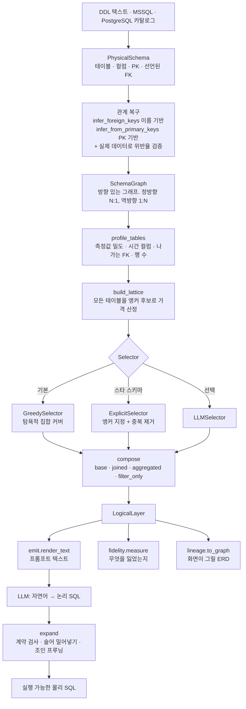

# tablefold 아키텍처

물리 데이터베이스 스키마를 **소수의 넓은 논리 모델**로 접고(Fold), 그 모델을 향해
쓰인 논리 SQL을 실행 가능한 물리 SQL로 되돌린다(Expand).

이 문서의 모든 수치는 **NL2SQL 데이터베이스(19테이블, 165컬럼)에서 실제로 측정한
값**이다. 추정치나 예시가 아니다.

---

## 1. 무엇을 푸는가

Text-to-SQL이 실패하는 자리는 대개 모델의 능력이 아니라 **조인**이다. 조인을
틀리는 방식은 두 가지고, 둘 다 예외 없이 조용히 틀린다.

**하나. 방향을 착각한다.**

```
F_SALES 30,752행  →  D_SA_ORG 붙임  →  30,752행   (변화 없음)
D_SA_ORG     13행  →  F_SALES 붙임  →  30,752행   (2,365배)
```

매출 1건은 조직 1개를 가리키므로 조직 컬럼을 매출 줄에 붙여도 행이 안 는다.
반대 방향은 조직 하나가 수천 번 복제된다.

**둘. 그 상태에서 합계를 낸다.**

```
D_SA_ORG + F_SALES + F_MGMT_PLAN 을 그냥 조인 = 2,598,785행

진짜 매출 합계        671,693,978,790
그 표에서의 합계   33,018,001,631,825   ← 49배
```

에러 없이 49배 틀린 답이 나온다. tablefold의 존재 이유가 이것이다.

---

## 2. 두 방향, 두 처리

| 관계 | 처리 | 이유 |
|---|---|---|
| **N:1** (정방향 FK) | 그대로 인라인 | 참조 대상이 최대 한 행이라 입도가 안 변한다 |
| **1:N** (역방향) | `GROUP BY` 선집계 후 조인 | 인라인하면 부모 행이 불어나 모든 합계가 오염된다 |

선집계된 서브쿼리는 부모 키당 최대 한 행을 내므로, 뒤이은 조인이 부모의 행 수를
바꾸지 못한다. 이것이 **입도 보호(grain guard)** 다.

### 한 표로 다 못 합치는 이유

**하나의 표는 하나의 입도만 가진다.**

| 모델 | 한 줄이 뜻하는 것 | 답할 수 있는 질문 |
|---|---|---|
| `F_SALES` | 매출 1건 | "7월 3일 A품목 매출 상세" |
| `D_ORG` | 조직 1개 | "조직별 매출 대 계획" |

같은 데이터인데 질문이 요구하는 줄 단위가 다르다. 그래서 최소 개수가 1이 아니다 —
NL2SQL에서는 **6개**다.

---

## 3. 파이프라인



| 단계 | 모듈 | 결정하는 것 |
|---|---|---|
| 탐색 | `introspect/{ddl,mssql,postgres}.py` | 물리 스키마 |
| 관계 복구 | `graph/graph.py`, `graph/from_keys.py` | 어느 테이블이 어느 테이블을 가리키는가 |
| 점수 | `scoring/classify.py` | 어느 테이블이 사건 기록에 가까운가 |
| 선택 | `clustering/{cluster,select}.py` | 어느 테이블을 앵커로 삼는가 |
| 합성 | `composition/compose.py` | 각 모델이 어떤 필드를 갖는가 |
| 측정 | `presentation/fidelity.py` | 무엇을 잃었는가 |
| 확장 | `expansion/expand.py` | 논리 SQL → 물리 SQL |

---

## 4. 필드의 네 종류

종류는 분류가 아니라 **정합성 제약**이다. 각 묶음에는 어겨서는 안 되는 규칙이
하나씩 달려 있다.

| 종류 | 무엇 | 규칙 |
|---|---|---|
| `base` | 앵커 자신의 컬럼 | — |
| `joined` | N:1로 따라가 인라인한 컬럼 | — |
| `aggregated` | 1:N 자식을 접은 값 | 이미 총계다. 앵커 행들에 걸친 `SUM` 재집계는 **정상**이다 |
| `filter_only` | 그 집계에 조건을 걸 통로 | `WHERE`에서 `AND`로만. `SELECT`·`GROUP BY`·`ORDER BY` 불가 |

### `SUM`을 다시 씌워도 되는 이유

자식 행 하나는 앵커 행 하나에만 속하므로 롤업은 이중 계산이 아니다. 실측:

```
SUM(f_sales_SALES_AMT_sum) over D_SA_ORG  = 671,693,978,790
SUM(F_SALES.SALES_AMT)                    = 671,693,978,790   ← 마지막 자리까지 일치
```

`AVG`는 다르다. 총계들의 평균은 개별 행의 평균이 아니다.

### `filter_only`가 없으면 못 하는 것

`SUM(SALES_AMT)`는 이미 전 기간을 더한 뒤다. **"이번 달 매출"을 물을 방법이 없다.**
`filter_only` 필드가 그 조건을 받고, `expand`가 조건을 집계 서브쿼리 *안*으로
옮긴다.

조건은 자식 자신이 아니라 **자식이 가리키는 차원**에 걸리기도 한다. "매출액 계정만
합계"는 `F_PL`이 아니라 `D_PL_ACCT.PL_ACCT_NM`의 이야기다. 그래서 경로를 두 단으로
두고, 확장이 서브쿼리 안에서 그 차원까지 조인한다.

---

## 5. 확장이 집행하는 계약

`expand`는 번역기가 아니라 **검사기**다. 아래를 코드로 거부한다.

| 거부하는 것 | 이유 |
|---|---|
| 모델 두 개 이상 참조 | 조인이 돌아온다. 두 모델이 같은 필드명을 가지면 결과 SQL이 모호해진다 |
| 모르는 필드 | CTE에 투영되지 않아 데이터베이스에서 터진다 |
| `filter_only`를 `SELECT`/`GROUP BY`/`ORDER BY`에 | 앵커 한 행에 대응하는 값이 없다 |
| `filter_only`를 `OR`로 묶음 | 쪼개면 뜻이 달라진다 |
| 질의의 CTE가 물리 테이블 이름을 가림 | 엉뚱한 원본에서 값을 뽑고 **정상 종료한다** |

같은 모델을 스칼라 서브쿼리에서 다시 읽는 것은 **허용한다** — 모든 참조가 같은 CTE를
가리키므로 모호할 것이 없다.

### 조인 방향

조건이 걸린 자식은 `INNER`, 안 걸린 자식은 `LEFT`.

```
"7월 매출"  LEFT 로 두면  13행 (그중 NULL 5행)
            INNER 로 하면  8행   ← 정답
```

7월에 매출이 없는 조직은 답에서 빠져야 한다. 반대로 조건이 없으면 `LEFT`를
유지한다 — "주문이 하나도 없는 고객"처럼 자식이 없다는 사실 자체가 답인 질문을
지우면 안 된다.

---

## 6. 실제 확장 결과

### 조인 프루닝

모델에 조인 경로가 여럿이어도, 질의가 실제로 쓴 필드에 필요한 것만 만든다.

```sql
-- 논리
SELECT tier_label, SUM(grand_total) AS revenue FROM orders GROUP BY tier_label
```
```sql
-- 확장 결과
WITH tf__orders AS (
  SELECT
    base.grand_total AS grand_total,
    j_customers_customer_id__customer_tiers_tier_id.label AS tier_label
  FROM orders AS base
  LEFT JOIN customers AS j_customers_customer_id
    ON base.customer_id = j_customers_customer_id.id
  LEFT JOIN customer_tiers AS j_customers_customer_id__customer_tiers_tier_id
    ON j_customers_customer_id.tier_id = j_customers_customer_id__customer_tiers_tier_id.id
)
SELECT tier_label, SUM(grand_total) AS revenue
FROM tf__orders AS orders
GROUP BY tier_label
```

별칭에 **조인 컬럼이 들어간다**. `orders.buyer_id`와 `orders.seller_id`가 둘 다
`users`를 가리킬 때 대상 이름만 쓰면 두 경로가 한 별칭으로 뭉개진다.

### 1:N 선집계

```sql
-- 논리
SELECT order_items_quantity_sum FROM orders
```
```sql
WITH tf__orders AS (
  SELECT agg_order_items_order_id.order_items_quantity_sum AS order_items_quantity_sum
  FROM orders AS base
  LEFT JOIN (
    SELECT order_id, SUM(quantity) AS order_items_quantity_sum
    FROM order_items
    GROUP BY order_id
  ) AS agg_order_items_order_id
    ON base.id = agg_order_items_order_id.order_id
)
SELECT order_items_quantity_sum FROM tf__orders AS orders
```

### 팩트 간 질문 — 차원 앵커가 푼다

팩트는 팩트를 참조하지 않는다. 그래서 팩트를 앵커로 잡으면 팩트 간 질문이
**원리적으로** 불가능하다. 차원을 앵커로 삼으면 두 팩트가 나란히 선집계된다.

```sql
-- 논리 (조인 0개)
SELECT HEAD_NM,
       SUM(f_sales_SALES_AMT_sum)        AS 매출,
       SUM(f_mgmt_plans_SALES_PLAN_AMT_sum) AS 계획
FROM D_SA_ORG
WHERE f_sales_YYYYMMDD LIKE '201007%' AND f_mgmt_plans_YYYYMM = '201007'
GROUP BY HEAD_NM
```

확장이 두 팩트를 각각 사전집계해 `INNER JOIN`으로 붙인다. 사람이 손으로 쓴 조인과
같은 6행을 낸다.

### 집계된 자식의 차원에 조건 걸기

```sql
-- 논리
SELECT HEAD_NM, SUM(f_pls_PL_AMT_sum) AS 금액 FROM D_FI_ORG
WHERE f_pls_PL_ACCT1_NM = '제조원가' GROUP BY HEAD_NM
```
```sql
-- 확장이 만든 서브쿼리
SELECT src.ORG_CD, SUM(src.PL_AMT) AS f_pls_PL_AMT_sum
FROM dbo.F_PL AS src
INNER JOIN dbo.D_PL_ACCT AS dim_d_pl_acct
  ON src.PL_ACCT_CD = dim_d_pl_acct.PL_ACCT_CD
WHERE dim_d_pl_acct.PL_ACCT1_NM = '제조원가'
GROUP BY src.ORG_CD
```

손으로 쓴 3중 조인과 **값이 마지막 자리까지 일치**했다. 자식에 별칭(`src`)을 붙이는
이유는 자식과 차원이 같은 이름의 컬럼을 갖기 때문이다 — 조인 키가 바로 그렇다.

---

## 7. 무엇을 잃었는지 잰다

압축 엔진에는 두 축이 있어야 한다. **얼마나 줄었는가**(rate)와 **무엇을 잃었는가**
(distortion). tablefold는 오랫동안 앞의 축만 갖고 있었고, 그래서 "테이블을 버려서
비율을 좋게 만드는" 개선이 개선처럼 보였다.

`fidelity.measure()`가 네 가지를 잰다. **하나로 합치지 않는다** — 합치는 순간
정당화할 수 없는 가중치가 결론을 정한다.

| 지표 | 재는 것 |
|---|---|
| 컬럼 보존 | 답이 될 수 있는 컬럼 중 꺼낼 수 있는 비율 (적재 메타는 분모에서 제외) |
| 조인 흡수 | FK 엣지 중 양 끝이 한 모델에 들어간 비율 |
| **답변 가능 쌍** | 거리 2 이내 테이블 쌍 중 조인 없이 답할 수 있는 비율 |
| 팬아웃 방어 | 집계로 접힌 1:N 자식의 수 |

### 이 지표의 한계 — 반드시 알아야 한다

`pair_answerability`는 테이블 **두 개**가 한 모델에 있느냐만 본다. 실제 업무 질문은
3~5개를 동시에 요구한다. NL2SQL 업무 주제표 9개로 재봤을 때:

```
쌍 기준 100%   ↔   주제 기준 5/9 (56%)
```

**쌍 지표가 실제 실패를 가렸다.** 업무 주제 목록이 있으면 그것으로 재는 편이
훨씬 낫다. 이 착시를 세 번 고치고 나서야 9/9가 됐다.

---

## 8. 앵커를 무엇으로 잡느냐가 무엇을 물을 수 있느냐다

NL2SQL 19테이블 실측:

| 앵커 모드 | 모델 | 프롬프트 | 컬럼 보존 | 답변 가능 쌍 |
|---|---|---|---|---|
| 팩트 | 10 | 8,466자 | 74.0% | 38.5% |
| 차원 | 9 | 27,927자 | 74.8% | 92.6% |
| **혼합 (중복 제거)** | **6** | **18,778자** | **85.0%** | **100%** |

**혼합이 차원보다 작으면서 더 많이 답한다.** 팩트와 차원을 그냥 합치면 19개
모델이 되는데, 그중 절반은 답할 수 있는 질문을 하나도 늘리지 않는다. 앵커가 사는
것은 테이블이 아니라 *조합*이기 때문이다 — 이미 다른 앵커가 담은 조합을 또 담아
봐야 새로 답할 수 있게 되는 질문이 없다. `prune_redundant`가 그런 앵커를 뺀다.

### 대칭

- **차원 앵커**는 팩트끼리 잇는다 (`D_ORG`가 여러 팩트를 선집계로 안는다)
- **팩트 앵커**는 차원끼리 잇는다 (`F_PRODUCTION`이 `D_WORKSHOP`과 `D_ITEM`을 함께)

그래서 둘 다 필요하다. 다만 **모든** 팩트가 필요한 것은 아니다.

---

## 9. 실측으로 얻은 판단들

### 관계는 전부 남긴다, 좁은 것만 고르지 않는다

`ORG_CD`는 `D_ORG`(46) · `D_SA_ORG`(13) · `D_FI_ORG`(10) 셋 모두에 위반 없이
들어맞는다. 한때 "더 구체적인 쪽이 맞다"며 가장 좁은 하나만 골랐는데, 그것이
그래프를 조각냈다 — `F_SALES`는 `D_SA_ORG`로, `F_STOCK`은 `D_FI_ORG`로 끌려가 한
모델에서 만나지 못했다.

```
좁은 것만   모델 8  22,716자  주제 7/9
전부 남김   모델 6  18,778자  주제 9/9
```

엣지를 늘렸는데 모델이 줄었다. `D_ORG` 하나가 두 조직 차원을 대신하게 되면서
중복 앵커 제거가 둘을 걸러냈다.

### 모델당 필드 상한이 진짜 병목이었다

`MAX_MODEL_FIELDS = 64`로 두면 `D_FI_ORG`처럼 12개 표를 안는 모델에서 `F_PL`이
통째로 잘려 나간다. 주제 기준으로 **64 → 4개, 120 → 6개, 200 → 7개**가 풀린다.

### 적재 메타데이터는 잡음이다

`LOAD_DT` / `LOAD_USER` 같은 컬럼이 155개 참조 컬럼 중 20개를 차지했고, 그중
10개는 **데이터가 전부 NULL**이었다. 빼면 프롬프트 18% 감소, 답변 가능 100% 유지,
값 컬럼 소실 0.

보존율 분모에서도 뺀다. 안 빼면 잡음을 제거하는 개선이 지표를 93.9%에서 71.5%로
떨어뜨려 정확히 잘못된 것을 보상한다.

### 관측하지 못한 신호는 상수로 메우지 않는다

행 수를 모를 때 `size_signal = 0.5`을 쓰면, 스키마 안의 *다른* 테이블 하나가
통계를 갖고 있느냐에 따라 같은 테이블이 FACT와 DIMENSION 사이를 오간다. 항을 빼고
나머지 가중치를 다시 정규화한다.

---

## 10. 아직 못 하는 것

| 한계 | 내용 |
|---|---|
| 두 기간 비교 | `filter_only`가 `WHERE`·`AND`로만 걸려서 "당월 vs 전년동월"을 한 질의에 못 담는다 |
| 자기 참조 계층 | `manager_id` 같은 자기 참조는 탐색이 건너뛰어 모델이 안 나온다 |
| 윈도우 함수 안의 `filter_only` | 밀어넣지 못하고 거부된다 (미검증) |
| 필드별 데이터 프로파일 | 값이 전부 NULL인 컬럼을 표시하지 않는다 — 골드셋에서 LLM이 실제로 그런 컬럼을 골랐다 |

---

## 11. 골드셋 측정 (48문항, NL2SQL)

Gemini 3.6 Flash High에 논리 모델 명세만 주고 SQL을 쓰게 한 결과:

```
확장 실패        0/48    ← 논리 SQL → 물리 SQL 변환 전부 성공
실행 오류        0/48    ← 생성된 SQL이 전부 데이터베이스에서 돎
답 못 함         3/48    (1차 12건에서 감소)
값 일부 재현    31/48
완전 일치        0/48
```

골드가 참조하는 **물리 컬럼 59종이 전부 레이어에 있다** (결손 0). 나머지 38종은
정답 SQL이 서브쿼리 안에서 계산한 별칭이다.

완전 일치 0의 뜻을 정확히 읽어야 한다. 골드 SQL은 35/48이 2단 이상 중첩, 37개가
`CASE`, 10개가 `UNION`이다. 완전 일치는 "**분석가가 쓴 그 SQL을 그대로
재현했는가**"를 재는 것이고 tablefold의 책임이 아니다. `SA_0006`은 매출액 값이
마지막 자리까지 일치했고 agy가 컬럼 두 개를 덜 냈을 뿐이다.

**tablefold가 책임지는 부분(확장·실행·데이터 결손)은 전부 통과했다.** 남은 병목은
에이전트 층이다 — 어느 컬럼을 골라야 하는지, 어떤 컬럼들을 더해야 하는지, 스냅샷인지
합계인지.
