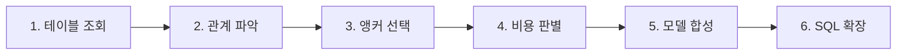

# tablefold 결과 보고

---

## 0. 초기 설계 및 가설

### 0.1 초기 설계
* **문제 의식**: 기존 Text-to-SQL 파이프라인(t2sql-package)은 질문이 들어올 때마다 테이블 선택 ➔ 컬럼 선택 ➔ 외래키 관계 파악 ➔ SQL 생성 에이전트를 거치는 다단계 LLM 호출 및 RAG 파이프라인에 의존했다.  
이로 인해 정보 과잉으로 인한 컨텍스트 노이즈, 조인 경로 추론 시 LLM 환각, 그리고 다단계 호출로 인한 응답 지연이 발생했다.
* **해결 구상 (Table Folding)**: 
  사람이나 질의 시점 RAG 엔진이 매번 테이블을 조율하는 대신, 빌드 시점(Build-time)에 스키마 그래프 알고리즘을 통해 물리 테이블들을 소수의 넓은 통합 가상 모델(Wide Logical Model)로 사전 압축(Fold)해 둔다.  
  LLM은 복잡한 물리 테이블 간 Foreign Key 조인 경로를 고민할 필요 없이 가상의 와이드 단일 테이블을 바라보고 단순한 **Logical SQL**을 생성하고, 뒤단의 결정론적 AST 컴파일러가 이를 선집계 CTE 구문을 포함한 **Physical SQL**로 100% 자동 확장하도록 설계했다.

### 0.2 가설
1. **가설 1 (컨텍스트 압축 및 환각 제거)**: "프롬프트에 입력되는 스키마 토큰과 테이블 수를 사전 접기(Fold)로 70~80% 절감하면, LLM이 잘못된 테이블이나 조인 경로를 선택하는 환각 현상이 사라져 SQL 성공률이 크게 향상될 것이다."
2. **가설 2 (질의 시점 인프라 무의존성)**: "질의 시점(Query-time)의 복잡한 RAG 벡터 검색(벡터디비, 임베딩, 에이전트 라우팅)을 배제하고, 빌드 시점의 1회성 사전 컴파일 레이어만 유지해도 빠른 결정론적 SQL 작성이 가능할 것이다."

---

## 1. Wren AI란 무엇인가

Wren AI는 오픈소스 Text-to-SQL 시스템이다. 핵심은 LLM이 물리 데이터베이스를 직접 보지 않게 하는 것이다.

물리 스키마에는 테이블이 수백 개, 컬럼이 수천 개 있다. 이것을 프롬프트에 그대로 넣으면 세 가지가 무너진다.  
토큰이 너무 많아 프롬프트에 다 안 들어가고, 들어가더라도 잡음이 심해 정확도가 떨어지고, 조인 경로를 LLM이 매번 다르게 추론하면서 환각이 발생한다.

Wren AI는 이 문제를 두 개의 축으로 나눠서 해결한다.

첫 번째는 MDL(Modeling Definition Language)이다. 물리 스키마 위에 비즈니스 의미를 담은 시맨틱 계층을 사람이 직접 작성한다.  
예를 들어 `orders` 테이블과 `customers` 테이블의 관계, 카디널리티(N:1, 1:N), `총매출` 같은 지표의 산출 공식을 YAML/JSON 형태로 선언한다.

```yaml
models:
  - name: orders
    table_reference:
      schema: public
      table: raw_orders
    primary_key: order_id
    columns:
      - name: order_id
        type: integer
        description: "주문 고유 ID"
      - name: status
        type: varchar
        description: "주문 상태 (COMPLETED, REFUNDED, PENDING 등)"

      # 비즈니스 로직이 담긴 계산된 필드 (Calculated Field)
      - name: is_refunded
        type: boolean
        is_calculated: true
        expression: "status = 'REFUNDED'"
        description: "해당 주문이 환불 처리된 상태인지 여부"

  - name: refunds
    table_reference:
      schema: public
      table: raw_refunds
    primary_key: refund_id
    columns:
      - name: refund_id
        type: integer
        description: "환불 처리 고유 ID"
      - name: order_id
        type: integer
        description: "주문 ID"

# 2. Relationships 정의
relationships:
  - name: refunded_orders_to_refunds
    models: [orders, refunds]
    join_type: one_to_many  # 1:N 관계 (1개 주문에 부분 환불 등 N개 환불 건 생성 가능)
    condition: "orders.order_id = refunds.order_id AND orders.status = 'REFUNDED'"
    description: "환불 완료(REFUNDED) 상태인 주문 건만 refunds 테이블과 조인"
```

LLM은 이 시맨틱 계층을 향해 질의하고, Rust 기반 엔진(wren-core)이 CTE 확장과 자동 JOIN 주입을 수행하여 실행 가능한 물리 SQL로 되돌린다. 확률적 추론이 결정론적 SQL 생성으로 바뀌는 지점이다.

두 번째는 질의 시점 스키마 압축이다. MDL이 아무리 잘 정리되어 있어도 모델이 수백 개면 프롬프트에 여전히 안 들어간다. 그래서 질문이 들어올 때마다 RAG 파이프라인으로 스키마를 잘라낸다. 스키마를 테이블/컬럼/지표/QA 단위로 쪼개 벡터 DB(Qdrant)에 색인하고, 질문으로 후보 테이블 Top-K를 뽑은 뒤, LLM 2차 검증으로 실제 필요한 2~3개만 남기고, 거기서 다시 관련 컬럼만 추출해 고밀도 컨텍스트를 재구성한다. 이 과정에서 쿼리당 토큰이 80~90% 절감된다.

요약하면, MDL은 사람이 비즈니스 지식을 구조화하는 것이고, RAG 파이프라인은 그 구조에서 질문에 필요한 부분만 꺼내는 것이다. 이 두 축이 합쳐져서 LLM이 소수의 정확한 테이블과 컬럼만 보고 SQL을 작성하게 된다.

---

## 2. tablefold의 접근 동기

Wren AI에서 가져온 컨셉은 **테이블 정보를 압축해서 제공한다**는 것이다.

현재 사용 중인 t2sql-package는 SQL을 생성하기 위해 여러 단계를 거친다. 테이블을 선택하고, 컬럼을 선택하고, 관계를 파악하고, 이 모든 정보를 조합해서 SQL 생성 에이전트에게 전달한다.  
각 단계마다 LLM 호출과 벡터 검색이 발생하고, 조회되는 정보의 양이 많다.

이 **정보 과잉**이 문제다. 프롬프트에 들어가는 스키마 정보가 많아질수록 LLM이 핵심을 놓칠 확률이 높아지고, 조인 경로를 잘못 추론하는 환각이 발생하며, 처리 시간도 길어진다.

테이블을 사전에 압축해서 LLM에게 주는 정보 자체를 줄일 수 있다면, 다단계 조회 없이도 빠른 시간 안에 환각 없이 SQL을 생성할 수 있지 않을까. 이것이 tablefold의 시작이다.

---

## 3. tablefold 파이프라인

tablefold는 물리 스키마를 소수의 넓은 논리 모델로 접고(Fold), 그 모델을 향해 작성된 논리 SQL을 실행 가능한 물리 SQL로 되돌린다(Expand). 전체 과정은 6단계로 이루어진다.



**1단계: 테이블 조회**

DDL 파일이나 데이터베이스 카탈로그에서 물리 스키마를 읽어온다. 테이블, 컬럼, 타입, 기본 키, 선언된 외래 키, 행 수를 수집한다.

**2단계: 관계 파악**

테이블 간의 관계를 복구한다. 웨어하우스는 외래 키를 선언하지 않는 경우가 흔하기 때문에, 컬럼 이름 패턴이나 기본 키 매칭으로 누락된 외래 키를 추론하고, 실제 데이터의 위반율을 검증해서 신뢰할 수 있는 관계만 남긴다. 이 결과로 방향 있는 그래프가 만들어진다.

**3단계: 앵커 선택**

어떤 테이블을 모델의 중심(앵커)으로 삼을지 결정한다. 앵커가 모델이 가질 기준(한 줄이 무엇을 뜻하는가)을 결정하고, 이것이 답할 수 있는 질문의 범위를 정한다. 최소한의 모델 수로 최대한 많은 테이블을 커버하도록 탐욕적 집합 커버 알고리즘을 사용한다.

**4단계: 비용 판별**

각 앵커가 주변 테이블을 흡수할 때 발생하는 필드 비용을 계산한다. 레이어 전체 예산과 모델 하나의 상한을 따로 두어, 하나의 앵커가 예산을 독식하지 못하게 한다. 비용이 이득에 비해 너무 크면 해당 테이블은 흡수하지 않는다.  
필드개수, 집계 조인 컬럼 비대, 테이블 개수 한도 등

**5단계: 모델 합성**

앵커를 중심으로 넓은 논리 모델을 만든다. N:1 관계(정방향)의 컬럼은 그대로 인라인하고, 1:N 관계(역방향)의 테이블은 GROUP BY로 미리 집계한 뒤 조인한다. 1:N을 그대로 인라인하면 행이 복제되어 합계가 부풀어 오르는 문제가 있기 때문이다.

**6단계: SQL 확장**

LLM이 와이드 논리 모델을 보고 작성한 논리 SQL을 받아서, 실행 가능한 물리 SQL로 변환한다. 모델에 경로가 여러 개 있어도 실제로 사용된 필드에 필요한 조인만 만들고(조인 프루닝), 필터 조건은 집계 서브쿼리 안으로 밀어넣는다.

---

## 4. 웹 데모

위 파이프라인의 결과를 시각적으로 확인할 수 있는 웹 페이지를 만들었다.

웹에서는 물리 스키마가 몇 개의 논리 모델로 접혔는지, 각 모델이 어떤 테이블을 흡수했는지, 필드 구성이 어떻게 되는지를 확인할 수 있다. 원본 테이블 간 관계 그래프와 압축된 논리 모델의 ERD를 나란히 비교할 수 있고, 논리 SQL을 입력하면 물리 SQL로 확장되는 과정도 확인할 수 있다.

---

## 5. Wren AI와 tablefold의 차이

### 핵심 차이

| 구분 | Wren AI | tablefold |
|---|---|---|
| 논리 계층 출처 | 사람이 MDL 작성 | 그래프 알고리즘이 생성 |
| 압축 시점 | 질의 시점 (질문마다 RAG로 검색) | 빌드 시점 (스키마마다 한 번) |
| 압축 단위 | 이 질문에 필요한 테이블 2~3개 | 스키마 전체를 담은 논리 레이어 |
| 필요 인프라 | 벡터 DB, 임베딩, LLM 재선택 호출 | 없음 (그래프 알고리즘만) |
| 지표 정의 | MDL에 선언 (총매출 = ...) | 없음 |

### 차이로 인한 장단점

**tablefold가 유리한 부분.** 질문 시점에 인프라가 필요 없다. 벡터 DB도, 임베딩 호출도 없다. 레이어는 이미 만들어져 있고 질문은 그것을 그대로 읽는다. 검색이 놓쳐서 답을 못 하는 실패가 존재하지 않는다. 스키마가 바뀌면 다시 돌리면 되므로 유지보수 비용도 낮다.

**Wren AI가 유리한 부분.** 질의 시점에 검색하므로 스키마가 수백 테이블이어도 확장된다. tablefold는 레이어 전체가 프롬프트에 들어가야 하므로 스키마 크기에 상한이 있다. 또한 사람이 작성한 MDL에는 업무 지식이 들어간다. `총매출`의 정의, 기준 조직 체계 같은 것은 스키마에 적혀 있지 않고 사람만 안다. tablefold의 자동 유도로는 이 영역을 채울 수 없다.

### 적합한 활용 대상

Wren AI는 스키마가 크고, 도메인이 안정적이며, MDL을 작성할 여력이 있는 환경에 적합하다. 지표 공식과 비즈니스 규칙이 중요한 대시보드 환경에서 강하다.

tablefold는 처음 붙이는 데이터베이스, 외래 키가 선언되지 않은 웨어하우스, 스키마가 자주 바뀌는 환경에서 사람이 아무것도 안 써도 출발점을 만들어주는 역할에 적합하다. 테이블 수가 수십 개 이내인 환경에서 동작한다.

### 각각 보완해야 할 점

Wren AI는 MDL 작성 비용이 크다. 스키마가 바뀌면 다시 써야 하고, 처음 붙이는 데이터베이스에는 아무것도 없는 상태에서 시작해야 한다. tablefold 같은 자동 생성이 초기 뼈대를 만들어주면 그 위에 사람이 업무 규칙을 얹는 방식으로 보완할 수 있다.

tablefold는 업무 지식이 안 들어간다는 점(이건 필요하다고 생각), 프롬프트 크기에 상한이 있다는 점을 보완해야 한다. 질의 시점 검색을 결합하거나, 자동으로 만들어진 필드 이름에 사람이 비즈니스 이름을 부여하는 계층을 추가하는 것이 방향이 될 수 있다.

---

## 6. 회고

### 초기 가설과 한계

처음 생각한 가설은 join 키로 연결된 테이블들을 하나로 압축하면 LLM이 볼 스키마가 줄어들고, 그만큼 정확도가 올라갈 것이라고 생각했다.

실제로 구현하면서 두 가지 한계에 부딪혔다.

첫째, **join으로 연결되지 않은 테이블들을 어떻게 할 것인가.** 모든 테이블이 외래 키로 깔끔하게 연결되어 있지 않다. 특히 웨어하우스 환경에서는 외래 키 선언 자체가 없는 경우가 흔하고, 컬럼 이름도 관례를 따르지 않아 자동 추론이 실패하는 경우가 있었다.

둘째, **압축의 비용과 이득에 대한 정밀한 검증이 부족했다.** 테이블을 압축하면 프롬프트가 줄어드는 것은 분명하지만, 그 압축이 실제로 SQL 생성 정확도를 얼마나 개선하는지, 어떤 종류의 질문에서 효과가 크고 어디서 한계가 있는지를 체계적으로 측정하지 못했다.

### 발전 방향

이 한계를 보완하기 위해 네 가지 방향을 설계했다.

첫째, **파생키**. 물리적으로 같은 값은 아니지만 함수를 씌우면 동일해지는 컬럼을 관계로 인식하는 것이다. 예를 들어 매출 테이블의 `YYYYMMDD`(20250801)와 기간 테이블의 `YYYYMM`(202508)은 값이 다르지만, `LEFT(YYYYMMDD, 6)`을 씌우면 같은 키로 조인할 수 있다.

둘째, **비등가 조인**. 등호(=)가 아닌 조건으로 연결되는 관계를 처리하는 것이다. 예를 들어 급여 등급 테이블이 `min_salary`와 `max_salary` 구간으로 정의되어 있으면, 직원의 급여가 그 구간에 속하는지를 `BETWEEN`으로 매칭해야 한다.

셋째, **union**. 구조가 비슷한 테이블들의 컬럼을 통일하여 합치는 것이다. 예를 들어 `F_SALES_2024`와 `F_SALES_2025`가 연도별로 분리되어 있을 때, 가상 컬럼을 생성해서 하나의 매출 테이블처럼 합칠 수 있다.

넷째, **줄 단위 정의**. 키 컬럼만 모아서 한 줄이 무엇을 뜻하는지 명시적으로 정의하는 것이다. 예를 들어 매출 테이블의 한 줄이 "특정 일자 + 특정 조직 + 특정 품목의 매출 건"이라는 것을 `(YYYYMMDD, ORG_CD, ITEM_CD)`로 선언하면, 어떤 단위로 집계해야 하는지가 명확해진다.

이 네 가지를 통해 join 키로 연결되지 않는 테이블들에 대한 처리와, 더 다양한 관계 유형에 대한 대응이 가능해진다.

### 아쉬운 점

설계 당시 실제로 활용할 데이터에 대한 충분한 고려 없이 진행했다.  
로직의 각 단계를 정밀하게 테스트하려면 다양한 스키마 구조와 실제 업무 질문이 필요한데, 이 준비가 부족한 상태에서 구현에 들어갔기 때문에 엔진의 한계와 효과를 객관적으로 검증하는 데 어려움이 있었다. 
압축 비용 대비 이득이라는 핵심 가설을 데이터로 증명하지 못한 것이 가장 아쉬운 부분이다.
