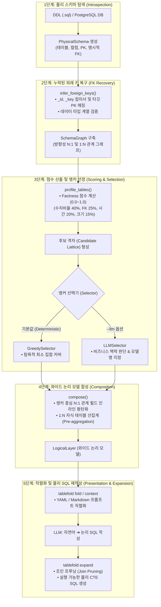

# 📐 tablefold 아키텍처 & 파이프라인 가이드

> **tablefold**는 수십 개의 복잡한 물리 DB 스키마를 LLM이 한눈에 파악할 수 있는 소수의 **와이드 논리 모델(Wide Logical Models)**로 접고(Fold), 작성된 논리 SQL을 안전하고 효율적인 물리 SQL로 펼쳐주는(Expand) 시스템입니다.

---

## 🕊️ 0. Wren AI 시맨틱 레이어 컨셉과 tablefold의 진화

### 💡 Wren AI의 핵심 컨셉 (Semantic Layer Abstraction)
* **배경**: 전통적인 Text-to-SQL은 복잡한 물리 DB 스키마(테이블/컬럼명, 수십 개의 조인 제약)를 LLM에 직접 전달함으로써 환각(Hallucination)과 잘못된 JOIN 쿼리를 유발했습니다.
* **Wren AI 접근 방식**: 물리 데이터베이스 위에 비즈니스 의미를 부여하는 **시맨틱 레이어(Semantic Layer / MDL: Modeling Definition Language)**를 도입하여, LLM이 물리 테이블 구조 대신 비즈니스 개념(예: `Order`, `Customer`)에 기반해 쿼리를 작성하도록 추상화했습니다.

### ⚡ tablefold의 발전과 패러다임 차이
`tablefold`는 Wren AI가 제시한 시맨틱 추상화 레이어의 이점을 한 단계 더 발전시켜, **수동 MDL 정의 없이 결정론적(Deterministic) 그래프 알고리즘으로 자동 구축**합니다.

| 비교 항목 | Wren AI 컨셉 (Semantic Layer) | tablefold 컨셉 (Fold & Expand) |
| :--- | :--- | :--- |
| **추상화 방식** | 시맨틱 모델링(MDL) 정의 기반 뷰 구축 | 그래프 기반 와이드 논리 모델(Wide Model) 자동 합성 |
| **외래키 복구** | 명시적/수동 릴레이션 정의 필요 | `infer_foreign_keys()`로 암묵적 FK 자동 추론 |
| **1:N 중복 방지** | 쿼리 타이밍 집계 또는 수동 비즈니스 뷰 | **Pre-aggregation (GROUP BY 선집계)**로 입도(Grain) 자동 유지 |
| **조인 최적화** | 정의된 뷰 중심 쿼리 | **Join Pruning** (실제 참조된 컬럼의 최소 조인만 남김) |
| **프롬프트 효율** | 전체 시맨틱 메타데이터 주입 | **Greedy Set Cover** 기반 소수 앵커 모델 (~3k 토큰) |

---

## 💡 1. 핵심 컨셉 (Core Concept)

Text-to-SQL의 주된 실패 원인은 LLM의 능력 부족보다는 **과도한 DDL 문맥(Context)과 복잡한 N:1 / 1:N 조인 추론 오류**입니다. `tablefold`는 이 문제를 **접기(Fold)**와 **펼치기(Expand)**의 2가지 패러다임으로 해결합니다.

```
물리 스키마 (50+ 테이블) ── Fold ──> 와이드 논리 모델 (~3k 토큰)
                           <── Expand ── 실행 가능한 물리 SQL (Join Pruned)
```

* **접기 (Fold)**: 앵커(Anchor) 테이블 중심으로 N:1 관계는 필드 평탄화(Denormalization), 1:N 자식 관계는 선집계(Pre-aggregation)로 묶어 입도(Grain)를 유지한 채 와이드 논리 모델을 생성합니다.
* **펼치기 (Expand)**: LLM이 논리 모델을 기반으로 생성한 SQL을 분석하여, 실제로 참조한 필드에 필요한 조인만 남기고(**Join Pruning**), 1:N 중복 계산 방지가 적용된 물리 CTE SQL로 자동 재작성합니다.

---

## 🗺️ 2. 디렉토리 구조 & 모듈 맵 (Directory & Module Map)

`tablefold`는 관심사의 분리와 단방향 데이터 흐름을 철저히 지키는 구조로 모듈화되어 있습니다.

```
src/tablefold/
├── 📄 __init__.py               # 패키지 익스포트
├── 📁 cli/                      # CLI 명령 인터페이스 (main.py)
├── 📁 schema/                   # 데이터 클래스 및 IR(Intermediate Representation)
│   └── 📄 ir.py                 # PhysicalSchema, LogicalLayer, JoinStep 등 정의
├── 📁 introspect/               # 1단계: 메타데이터 추출 (DDL 파싱 / PostgreSQL)
│   ├── 📄 ddl.py                # SQL DDL 파일 파서 (DDLIntrospector)
│   └── 📄 postgres.py           # DB 커넥션 기반 메타데이터 추출 (PostgresIntrospector)
├── 📁 graph/                    # 2단계: 외래키 추론 및 방향성 그래프 구축
│   └── 📄 graph.py              # infer_foreign_keys(), SchemaGraph
├── 📁 scoring/                  # 3단계-A: 테이블 특성 분석 및 점수 산출
│   └── 📄 classify.py           # Factness 점수 계산 (profile_tables)
├── 📁 clustering/               # 3단계-B: 후보 격자 형성 및 앵커 선택
│   ├── 📄 cluster.py            # 후보 모델 격자 탐색 (cluster)
│   └── 📄 select.py             # GreedySetCover / LLMSelector
├── 📁 composition/              # 4단계: 와이드 논리 모델 합성
│   └── 📄 compose.py            # N:1 평탄화 & 1:N 선집계 합성 (compose)
├── 📁 presentation/             # 5단계-A: 토큰 비용 산정 및 프롬프트 직렬화
│   ├── 📄 cost.py               # 토큰/필드 예산 계산
│   └── 📄 emit.py               # YAML / Markdown 프롬프트 직렬화
├── 📁 expansion/                # 5단계-B: 논리 SQL ➔ 물리 SQL 변환 및 조인 프루닝
│   └── 📄 expand.py             # Join Pruning & CTE 물리 SQL 자동 재작성
└── 📁 pipeline/                 # 전체 파이프라인 통합 오케스트레이터
    └── 📄 pipeline.py           # fold() 단일 진입점 함수
```

---

## 🔄 3. 파이프라인 데이터 흐름 (Pipeline Architecture)

전체 동작 과정은 단방향(Unidirectional) 파이프라인으로 구성되어 있습니다.



---

## 📋 4. 단계별 실행 순서 & 세부 로직 (Phase Breakdown)

| 단계 | 명칭 | 관련 모듈/파일 | 핵심 역할 및 세부 로직 |
|:---:|:---|:---|:---|
| **1** | **물리 스키마 탐색**<br/>*(Introspection)* | [`src/tablefold/introspect/`](file:///Users/n-whjeong/Developer/private/tablefold/src/tablefold/introspect)<br/>[`ddl.py`](file:///Users/n-whjeong/Developer/private/tablefold/src/tablefold/introspect/ddl.py) | DDL SQL 파싱 및 PostgreSQL 실시간 메타데이터 조회를 통해 테이블, 컬럼, PK, FK 정보를 추출하여 [`PhysicalSchema`](file:///Users/n-whjeong/Developer/private/tablefold/src/tablefold/schema/ir.py) 객체 생성 |
| **2** | **외래 키 복구 & 그래프**<br/>*(FK Recovery & Graph)* | [`src/tablefold/graph/`](file:///Users/n-whjeong/Developer/private/tablefold/src/tablefold/graph)<br/>[`graph.py`](file:///Users/n-whjeong/Developer/private/tablefold/src/tablefold/graph/graph.py) | 컬럼명 접미사(`_id`, `_key` 등)와 PK 타깃, 데이터 타입 호환성을 분석해 명시적 FK가 누락된 DB에서도 FK를 복구하고 방향성 그래프([`SchemaGraph`](file:///Users/n-whjeong/Developer/private/tablefold/src/tablefold/graph/graph.py#L32)) 구축 |
| **3** | **점수 산출 및 앵커 선정**<br/>*(Scoring & Selection)* | [`src/tablefold/scoring/classify.py`](file:///Users/n-whjeong/Developer/private/tablefold/src/tablefold/scoring/classify.py)<br/>[`src/tablefold/clustering/select.py`](file:///Users/n-whjeong/Developer/private/tablefold/src/tablefold/clustering/select.py) | • **Factness Scoring**: 테이블의 수치 컬럼, FK, 시간 정보로 Fact 점수(0.0~1.0) 계산<br/>• **Greedy Set Cover**: 최소 수의 모델로 목표 스키마 커버리지(`--coverage 0.9`)를 달성하는 앵커 테이블 선정 |
| **4** | **와이드 논리 모델 합성**<br/>*(Composition)* | [`src/tablefold/composition/`](file:///Users/n-whjeong/Developer/private/tablefold/src/tablefold/composition)<br/>[`compose.py`](file:///Users/n-whjeong/Developer/private/tablefold/src/tablefold/composition/compose.py) | 선정된 앵커를 중심으로 N:1 부모 필드는 인라인 평탄화하고, 1:N 자식 테이블은 행 왜곡(Fan-out) 방지를 위해 `GROUP BY` 선집계(Pre-aggregation) 필드로 합성 |
| **5** | **직렬화 및 SQL 확장**<br/>*(Presentation & Expand)* | [`src/tablefold/presentation/emit.py`](file:///Users/n-whjeong/Developer/private/tablefold/src/tablefold/presentation/emit.py)<br/>[`src/tablefold/expansion/expand.py`](file:///Users/n-whjeong/Developer/private/tablefold/src/tablefold/expansion/expand.py) | • **Fold/Context**: 와이드 모델을 YAML/Markdown 프롬프트 직렬화<br/>• **Expand**: LLM이 쓴 논리 SQL에서 실제 참조한 필드만 추려 조인을 자동 삭제(**Join Pruning**) 후 물리 CTE SQL 생성 |

---

## ⚙️ 5. 핵심 작동 로직 & 예시 (Core Logic & Examples)

### 1. 1:N 자식 테이블 선집계 (Pre-aggregation)
1:N 관계의 자식 테이블을 단순 `LEFT JOIN`하면 부모 테이블의 행이 중복되어 매출 및 금액 계산이 크게 왜곡됩니다. `tablefold`는 자식 테이블을 조인하기 전 **미리 집계**하는 CTE SQL을 구성합니다.

```sql
-- [1:N Pre-aggregation 예시]
-- order_items(자식)를 미리 GROUP BY로 선집계한 뒤 orders(부모)와 조인
LEFT JOIN (
  SELECT order_id, SUM(line_total) AS order_items_line_total_sum
  FROM order_items
  GROUP BY order_id
) AS agg_order_items ON base.id = agg_order_items.order_id
```

### 2. 불필요 조인 제거 (Join Pruning)
논리 모델에 10개의 조인 필드가 정의되어 있더라도, LLM 쿼리가 2개 필드만 사용한 경우 나머지 조인 경로를 모두 삭제합니다.

```sql
-- LLM 논리 SQL: SELECT customer_tier_label, SUM(grand_total) FROM orders GROUP BY 1

-- tablefold expand 결과 (필요한 조인만 조인 프루닝하여 생성)
WITH tf__orders AS (
  SELECT
    base.grand_total AS grand_total,
    j_customers__customer_tiers.label AS customer_tier_label
  FROM orders AS base
  LEFT JOIN customers AS j_customers ON base.customer_id = j_customers.id
  LEFT JOIN customer_tiers AS j_customers__customer_tiers ON j_customers.tier_id = j_customers__customer_tiers.id
)
SELECT customer_tier_label, SUM(grand_total) AS revenue
FROM tf__orders 
GROUP BY customer_tier_label
```
