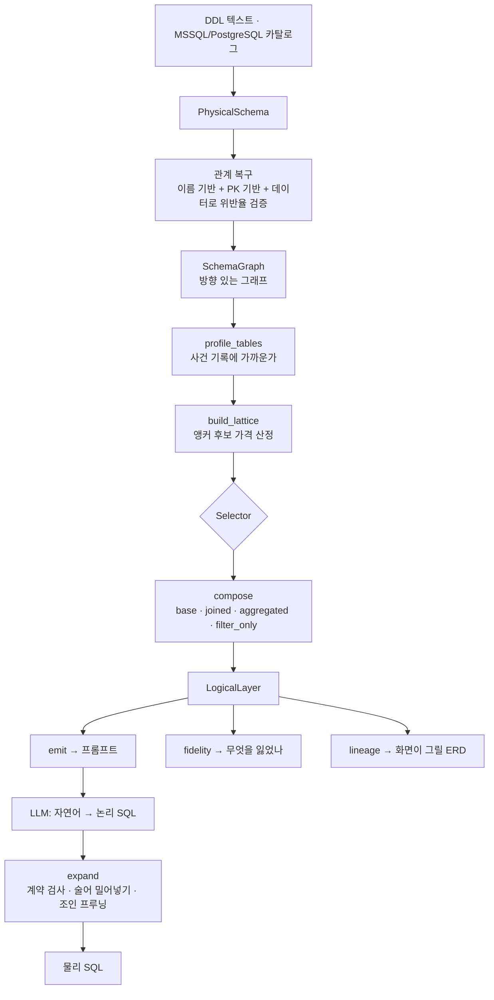

# tablefold 아키텍처

물리 데이터베이스 스키마를 **소수의 넓은 논리 모델**로 접고(Fold), 그 모델을 향해
쓰인 논리 SQL을 실행 가능한 물리 SQL로 되돌린다(Expand).

---

## 1. 문제

Text-to-SQL이 실패하는 자리는 모델의 능력이 아니라 **조인**이다. 그리고 조인은
틀려도 예외를 던지지 않는다. 문법이 맞으면 실행되고, 숫자만 틀린다.

틀리는 방식은 결국 하나로 수렴한다 — **입도(grain)가 깨진다.**

입도란 "한 줄이 무엇을 뜻하는가"다. `orders`의 한 줄은 주문 하나고, `customers`의
한 줄은 고객 하나다. 조인은 이 뜻을 바꾼다. 그런데 **방향에 따라 다르게 바꾼다.**

- **정방향**(외래 키를 따라감): 참조 대상이 최대 한 행이므로 줄 수가 안 변한다.
  주문에 고객 이름을 붙여도 여전히 주문 하나가 한 줄이다.
- **역방향**(참조당하는 쪽에서 봄): 하나에 여럿이 달린다. 고객에 주문을 붙이는
  순간 고객이 주문 수만큼 복제된다.

그 상태에서 합계를 내면 곱해진 만큼 부풀어 오른다. 실측에서 조직·매출·계획 세 표를
그냥 이었더니 **매출 합계가 49배**가 됐다. 에러는 없었다.

---

## 2. 두 방향, 두 처리

문제가 방향에서 오므로 해법도 방향별로 갈린다.

| 관계 | 처리 | 근거 |
|---|---|---|
| **N:1** (정방향) | 그대로 인라인 | 최대 한 행이라 입도가 보존된다 |
| **1:N** (역방향) | `GROUP BY` 선집계 후 조인 | 미리 접으면 부모 키당 한 행이 되어 입도가 보존된다 |

선집계된 서브쿼리는 부모 키당 **최대 한 행**을 낸다. 그래서 뒤이은 조인이 부모의
줄 수를 바꾸지 못한다. 이것이 입도 보호(grain guard)이고, 엔진의 중심 규칙이다.

### 한 표로 다 못 합치는 이유

**하나의 표는 하나의 입도만 가진다.** 이건 구현 한계가 아니라 정의다.

"7월 3일 A품목 매출 상세"는 매출이 한 줄이어야 답할 수 있고, "조직별 매출 대 계획"은
조직이 한 줄이어야 답할 수 있다. 같은 데이터인데 질문이 요구하는 줄 단위가 다르다.

그래서 결과물은 표 하나가 아니라 **모델 여러 개**다. 개수는 "몇 개의 입도에서
물을 것인가"가 정한다. NL2SQL 19테이블에서는 6개였다.

---

## 3. 파이프라인



| 단계 | 모듈 | 결정하는 것 |
|---|---|---|
| 탐색 | `introspect/` | 물리 스키마 |
| 관계 복구 | `graph/` | 무엇이 무엇을 가리키는가 |
| 점수 | `scoring/classify.py` | 어느 테이블이 사건 기록인가 |
| 선택 | `clustering/` | 어느 입도에서 물을 것인가 |
| 합성 | `composition/compose.py` | 각 모델의 필드 |
| 측정 | `presentation/fidelity.py` | 무엇을 잃었는가 |
| 확장 | `expansion/expand.py` | 논리 → 물리 |

### 관계 복구가 왜 별도 단계인가

웨어하우스는 외래 키를 잘 선언하지 않는다. 적재 성능을 깎고, ETL이 이미 정합성을
보장한다고 보기 때문이다. 그래서 스타 스키마인데 `sys.foreign_keys`가 비어 있는
경우가 흔하다.

두 가지로 복구한다. 이름 규칙(`customer_id` → `customers`)은 영어 명명에 기대므로
`ORG_CD` 같은 웨어하우스 이름에서 실패한다. 그래서 **기본 키를 참조 대상으로 삼는**
방식을 함께 쓰고, 후보마다 **실제 데이터로 위반율을 재서** 통과한 것만 남긴다.
추측이 아니라 관측으로 그래프를 만든다.

---

## 4. 필드의 네 종류

종류는 분류가 아니라 **정합성 제약**이다. 묶음마다 어겨서는 안 되는 규칙이 하나씩
달려 있다.

| 종류 | 무엇 | 규칙 |
|---|---|---|
| `base` | 앵커 자신의 컬럼 | — |
| `joined` | N:1로 인라인한 컬럼 | — |
| `aggregated` | 1:N 자식을 접은 값 | 이미 총계다. 앵커 행들에 걸친 `SUM` 재집계는 **정상** |
| `filter_only` | 그 집계에 조건을 걸 통로 | `WHERE`에서 `AND`로만 |

### `SUM`을 다시 씌워도 되는 이유

자식 행 하나는 앵커 행 하나에만 속한다. 그래서 앵커 행들에 걸친 롤업은 같은 자식을
두 번 세지 않는다. 실측에서 원본 합계와 마지막 자리까지 일치했다.

(`AVG`는 다르다. 총계들의 평균은 개별 행의 평균이 아니다.)

### `filter_only`가 왜 필요한가

`SUM(SALES_AMT)`는 이미 전 기간을 더한 뒤다. **"이번 달 매출"을 물을 방법이 없다.**
사전집계된 값에는 기간을 걸 수단이 없기 때문이다.

`filter_only` 필드가 그 조건을 받는 자리다. 값으로 꺼낼 수는 없다 — 자식 행마다
다르므로 앵커 한 행에 대응하는 값이 없다. `expand`가 그 조건을 집계 서브쿼리
*안*으로 옮긴다.

조건이 자식 자신이 아니라 **자식이 가리키는 차원**에 걸리기도 한다. "매출액 계정만
합계"는 `F_PL`이 아니라 `D_PL_ACCT`의 이야기다. 그래서 경로를 두 단으로 두고,
확장이 서브쿼리 안에서 그 차원까지 조인한다.

---

## 5. 확장은 번역기가 아니라 검사기다

논리 모델은 **계약**이다. 계약을 문서로만 적어 두면 지켜지지 않는다. `expand`가
코드로 집행한다.

| 거부 | 이유 |
|---|---|
| 모델 두 개 이상 참조 | 조인이 돌아온다. 같은 필드명을 가지면 결과가 모호해진다 |
| 모르는 필드 | CTE에 없으므로 데이터베이스에서 터진다 |
| `filter_only`를 `SELECT`/`GROUP BY`/`ORDER BY` | 앵커 한 행에 대응하는 값이 없다 |
| `filter_only`를 `OR`로 묶음 | 쪼개면 뜻이 달라진다 |
| 질의의 CTE가 물리 테이블 이름을 가림 | 엉뚱한 원본에서 값을 뽑고 **정상 종료한다** |

같은 모델을 스칼라 서브쿼리에서 다시 읽는 것은 허용한다. 모든 참조가 같은 CTE를
가리키므로 모호할 것이 없다.

### 조인 방향도 뜻을 담는다

조건이 걸린 자식은 `INNER`, 안 걸린 자식은 `LEFT`.

"7월 매출"을 물으면 7월에 매출이 없는 조직은 답에서 빠져야 한다. `LEFT`로 두면 그런
조직이 `NULL`을 달고 살아남는다. 반대로 조건이 없으면 `LEFT`를 유지한다 — "주문이
하나도 없는 고객"처럼 자식이 없다는 사실 자체가 답인 질문을 지우면 안 된다.

### 확장 예시

```sql
-- 논리 (조인 없음)
SELECT tier_label, SUM(grand_total) AS revenue FROM orders GROUP BY tier_label
```
```sql
-- 확장: 실제 쓴 필드에 필요한 조인만
WITH tf__orders AS (
  SELECT
    base.grand_total AS grand_total,
    j_customers_customer_id__customer_tiers_tier_id.label AS tier_label
  FROM orders AS base
  LEFT JOIN customers AS j_customers_customer_id
    ON base.customer_id = j_customers_customer_id.id
  LEFT JOIN customer_tiers AS j_customers_customer_id__customer_tiers_tier_id
    ON j_customers_customer_id.tier_id = j_customers_customer_id__customer_tiers_tier_id.id
)
SELECT tier_label, SUM(grand_total) AS revenue FROM tf__orders AS orders
GROUP BY tier_label
```

별칭에 **조인 컬럼이 들어간다**. `buyer_id`와 `seller_id`가 둘 다 `users`를 가리킬
때 대상 이름만 쓰면 두 경로가 한 별칭으로 뭉개진다.

```sql
-- 1:N 은 미리 접은 뒤 붙는다
LEFT JOIN (
  SELECT order_id, SUM(quantity) AS order_items_quantity_sum
  FROM order_items GROUP BY order_id
) AS agg_order_items_order_id ON base.id = agg_order_items_order_id.order_id
```

---

## 6. 앵커 선택 — 무엇을 물을 수 있느냐를 정한다

앵커는 모델이 앉을 입도다. 어느 테이블을 앵커로 삼느냐가 **답할 수 있는 질문의
범위**를 정한다.

### 팩트는 팩트를 참조하지 않는다

이 사실 하나가 구조를 규정한다. 팩트를 앵커로 잡으면 정방향으로 차원만 만나고,
팩트에는 자식이 없다. 그래서 **팩트 간 질문이 원리적으로 불가능하다** — "매출 대
계획"을 못 묻는다.

차원을 앵커로 잡으면 뒤집힌다. 조직 하나가 한 줄이고, 매출과 계획이 각각 선집계되어
나란히 붙는다. 팩트 간 질문이 조인 없이 풀린다.

**대칭이 성립한다:**

- **차원 앵커**는 팩트끼리 잇는다
- **팩트 앵커**는 차원끼리 잇는다 (`F_PRODUCTION`이 `D_WORKSHOP`과 `D_ITEM`을 함께)

그래서 둘 다 필요하다. 실측:

| 앵커 모드 | 모델 | 프롬프트 | 답변 가능 |
|---|---|---|---|
| 팩트만 | 10 | 8,466자 | 38.5% |
| 차원만 | 9 | 27,927자 | 92.6% |
| **혼합** | **6** | **18,778자** | **100%** |

### 다만 모든 앵커가 필요한 것은 아니다

**앵커가 사는 것은 테이블이 아니라 조합이다.** 어떤 테이블을 담고 있어도 그 조합을
다른 앵커가 이미 담고 있으면 새로 답할 수 있게 되는 질문이 없다.

팩트와 차원을 그냥 합치면 19개 모델이 되는데 그중 절반이 그런 경우였다.
`prune_redundant`가 빼면 **모델이 줄면서 프롬프트도 줄고 답변 범위는 그대로**다.

빼는 순서가 중요하다. 크게 기여하는 앵커를 먼저 빼면 그 자리를 작은 것 여럿이 메워
결과가 커진다. 작은 것부터 뺀다. 그리고 쌍만 보면 안 된다 — 이웃이 없는 테이블은
어떤 쌍에도 안 들어가므로, 그 테이블을 유일하게 담은 앵커가 조용히 사라진다.

---

## 7. 압축에는 두 축이 필요하다

압축 엔진에는 **얼마나 줄었는가**(rate)와 **무엇을 잃었는가**(distortion)가 함께
있어야 한다. 앞의 축만 있으면 "테이블을 버려서 비율을 좋게 만드는" 개선이 개선처럼
보인다.

`fidelity.measure()`가 네 가지를 잰다. **하나로 합치지 않는다** — 합치는 순간
정당화할 수 없는 가중치가 결론을 정한다.

| 지표 | 재는 것 |
|---|---|
| 컬럼 보존 | 답이 될 수 있는 컬럼 중 꺼낼 수 있는 비율 |
| 조인 흡수 | FK 엣지 중 양 끝이 한 모델에 들어간 비율 |
| **답변 가능 쌍** | 서로 가까운 테이블 쌍 중 조인 없이 답할 수 있는 비율 |
| 팬아웃 방어 | 집계로 접힌 1:N 자식의 수 |

분모도 뜻을 담아야 한다. `LOAD_DT` 같은 적재 메타데이터는 어떤 질문에도 답하지
않으므로 컬럼 보존의 분모에서 뺀다. 안 빼면 **잡음을 제거하는 개선이 지표를
떨어뜨려** 정확히 잘못된 것을 보상한다.

### 이 지표의 한계 — 반드시 알아야 한다

`pair_answerability`는 테이블 **두 개**가 한 모델에 있느냐만 본다. 실제 업무 질문은
3~5개를 동시에 요구한다.

```
쌍 기준 100%   ↔   업무 주제 기준 5/9
```

**쌍 지표가 실제 실패를 가렸다.** 업무 주제 목록이 있으면 그것으로 재는 편이 훨씬
낫다. 이 착시를 걷어내고 나서야 세 가지 실제 결함이 드러났고, 고친 뒤 9/9가 됐다.

---

## 8. 실측이 뒤집은 판단 셋

설계 직관이 데이터와 어긋난 자리들이다. 기록해 두는 이유는 같은 직관이 다시
돌아오기 때문이다.

**좁은 관계가 더 정확하지 않다.** `ORG_CD`가 조직 차원 셋 모두에 위반 없이 들어맞을
때, "더 구체적인 쪽이 맞다"며 가장 좁은 하나만 골랐다. 그것이 그래프를 조각냈다 —
매출과 재고가 각각 다른 조직 차원으로 끌려가 한 모델에서 만나지 못했다. 유효한
관계를 전부 남기니 **엣지가 늘었는데 모델은 줄었다.** 넓은 차원 하나가 좁은 둘을
대신하면서 중복 앵커 제거가 걸러 준 것이다.

**모델당 필드 상한이 진짜 병목이었다.** 탐색 깊이를 의심했지만, 실제로는 12개 표를
안는 모델에서 필드 상한에 걸려 팩트 하나가 통째로 잘려 나가고 있었다. 상한을 올리자
답 못 하던 주제들이 풀렸다.

**관측하지 못한 신호는 상수로 메우면 안 된다.** 행 수를 모를 때 중립값을 넣었더니,
스키마 안의 *다른* 테이블이 통계를 갖고 있느냐에 따라 같은 테이블의 역할이
FACT ↔ DIMENSION 사이를 오갔다. 항을 빼고 나머지 가중치를 다시 정규화해야 한다.

---

## 9. 아직 못 하는 것

| 한계 | 내용 |
|---|---|
| 두 기간 비교 | `filter_only`가 `AND`로만 걸려 "당월 vs 전년동월"을 한 질의에 못 담는다 |
| 자기 참조 계층 | `manager_id` 같은 자기 참조는 탐색이 건너뛴다 |
| 윈도우 함수 안의 `filter_only` | 밀어넣지 못하고 거부된다 (미검증) |
| 필드별 데이터 프로파일 | 값이 전부 `NULL`인 컬럼을 표시하지 않는다 |

---

## 10. 골드셋이 말해 준 것

실제 업무 질문 48문항에 논리 모델 명세만 주고 SQL을 쓰게 했다.

```
확장 실패   0/48     논리 SQL → 물리 SQL 변환 전부 성공
실행 오류   0/48     생성된 SQL이 전부 데이터베이스에서 돎
데이터 결손 0        정답이 쓰는 물리 컬럼이 전부 레이어에 있음
```

**tablefold가 책임지는 부분은 전부 통과했다.**

완전 일치는 0이었는데, 이 숫자를 정확히 읽어야 한다. 정답 SQL은 대부분 2단 이상
중첩에 `CASE`와 `UNION`을 쓴다. 완전 일치는 "**분석가가 쓴 그 SQL을 그대로
재현했는가**"를 재는 것이고 압축 엔진의 책임이 아니다. 실제로 값이 마지막 자리까지
맞으면서 컬럼 두 개를 덜 낸 케이스가 있었다.

남은 병목은 엔진이 아니라 **에이전트 층**이다 — 어느 컬럼을 골라야 하는지, 어떤
컬럼들을 더해야 하는지, 스냅샷인지 합계인지. 이 판단은 스키마 구조가 아니라 데이터의
분포와 업무 지식에서 온다.
